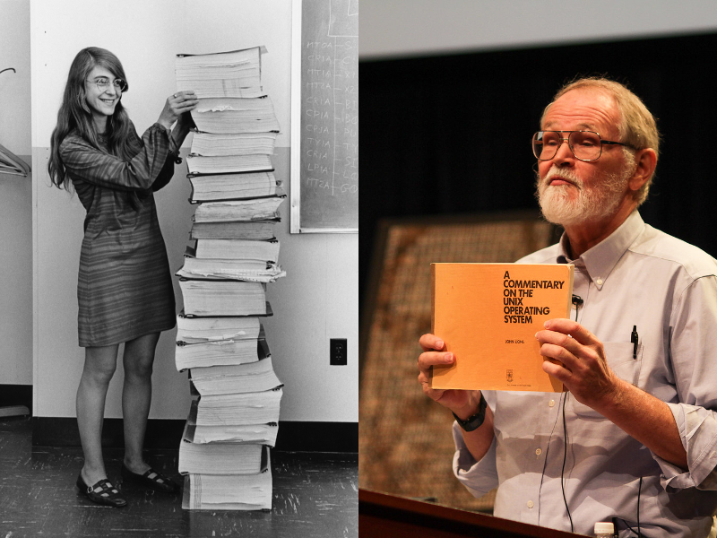

# Topics covered in this lecture

* What you will learn in this course
* What an OS is and why you want one
* Why you should know about OSes

---

# Class organization

* Lectures cover OS design
* Book: [OSTEP](http://pages.cs.wisc.edu/~remzi/OSTEP/)
* Five (graded) labs focus on practical OS aspects
    - C programming
    - Threading
    - Concurrency 
    - File systems (storage)
    - Security
* TAs handle all labs/homework questions
* Grading
    - Quizzes after each class (10%)
    - Labs during the semester (50%)
    - Final exam in the exam session (40%)
* Feedback: through questions, quizzes, emails, office hours.

---

# Time management

* 5 ECTS points map to, on average, 7 hours/week
* Divide and conquer: theory and labs

. . .

* 3 hours of theory/lectures
    * 2 hours class and reading
    * 30 minutes quiz
    * 30 minutes exercise

. . .

* 4 hours of programming
    * 2 hours of lab session and Q&A
    * 2 hours implementation on your own

---

# What is an Operating System?

\Begin{multicols}{2}

\begin{tikzpicture}
\node (A) at (0,6) [draw,orange,ultra thick,minimum width=4cm,minimum height=1.5cm] {User};
\node (B) at (0,4) [draw,green,ultra thick,minimum width=4cm,minimum height=1.5cm] {Application};
\node (C) at (0,2) [draw,blue,ultra thick,minimum width=4cm,minimum height=1.5cm] {Operating System};
\node (D) at (0,0) [draw,brown,ultra thick,minimum width=4cm,minimum height=1.5cm] {Hardware};

\path (A.south) -- (A.south west) coordinate[pos=0.5] (a00);
\path (B.north) -- (B.north west) coordinate[pos=0.5] (b01);
\draw[latex-] (a00) -- (b01);

\path (B.south) -- (B.south west) coordinate[pos=0.5] (b00);
\path (C.north) -- (C.north west) coordinate[pos=0.5] (c01);
\draw[latex-] (b00) -- (c01);

\path (C.south) -- (C.south west) coordinate[pos=0.5] (c00);
\path (D.north) -- (D.north west) coordinate[pos=0.5] (d01);
\draw[latex-] (c00) -- (d01);

\path (A.south) -- (A.south east) coordinate[pos=0.5] (a10);
\path (B.north) -- (B.north east) coordinate[pos=0.5] (b11);
\draw[latex-] (b11) -- (a10);

\path (B.south) -- (B.south east) coordinate[pos=0.5] (b10);
\path (C.north) -- (C.north east) coordinate[pos=0.5] (c11);
\draw[latex-] (c11) -- (b10);

\path (C.south) -- (C.south east) coordinate[pos=0.5] (c10);
\path (D.north) -- (D.north east) coordinate[pos=0.5] (d11);
\draw[latex-] (d11) -- (c10);

\end{tikzpicture}

OS is middleware between applications and hardware. 

* Provides standardized interface to resources
* Manages hardware
* Orchestrates currently executing processes
* Reacts to resource access requests
* Handles access control

\End{multicols}

---

# OS role #1: Standardized interface

> The OS provides common functionality to access resources.
> The OS abstracts hardware, provides a unified interface (e.g.,
> network chips A and B are accessed using the same API).

* Challenges:
    * Defining the correct abstractions (e.g., what level)
    * What hardware aspects should be exposed and how much
    * Discussion: how to abstract GPUs

---

# OS role #2: Resource management

> The OS shares (limited) resources between applications.

* Isolation: protect applications from each other
* Scheduling: provide efficient and fair access to resources
* Limit: share access to resources

---

# OS role analogy

The OS is like a waiter that serves individual clients. The waiter knows the
menu, records orders, and delivers food to the right table while keeping track
of the bill.

---

# What management services does an OS provide?

* ***CPU:*** initializes program counter/registers, shares CPU
* ***Program memory:*** initializes process address space, loads program (code,
  data, heap, stack)
* ***Devices:*** read/write from/to disk; device driver is hardware
  specific, abstracts to common interface

---

# (Short) History of Operating Systems

* Started as a convenience library of common functions
* Evolved from procedure calls to system calls
* OS code executes at higher privilege level
* Moved from single process to concurrently executing processes

{width=300px}

---

# OS building blocks

OS design nicely separates into three pillars, with security as a
transcendental layer covering all pillars.

\begin{tikzpicture}
\draw [orange, ultra thick] (0,0) rectangle (2,4);
\node[text width=3cm, rotate=90] at (1, 2.5) {Virtualization};
\draw [blue, ultra thick] (3,0) rectangle (5,4);
\node[text width=3cm, rotate=90] at (4, 2.5) {Concurrency};
\draw [green, ultra thick] (6,0) rectangle (8,4);
\node[text width=3cm, rotate=90] at (7, 2.5) {Persistence};

\draw [red, ultra thick] (0,4.5) -- (8,4.5);
\draw [red, ultra thick] (0,4.5) -- (4,6);
\draw [red, ultra thick] (4,6) -- (8,4.5);
\node[text width=3cm] at (5, 5) {Security};

\end{tikzpicture}

---

# Building block: Virtualization

Each application believes it has all resources for itself

* ***CPU:*** unlimited amount of instructions, continuous execution
* ***Memory:*** unlimited memory is available
* ***Challenge:*** how to share constrained resources

---

# Building block: Concurrency

OS must handle ***concurrent events*** and untangle them as necessary.

* Hide concurrency from ***independent*** processes
* Manage concurrency from ***dependent*** processes by providing
  synchronization and communication primitives
* ***Challenge:*** providing the right primitives

---

# Building block: Persistence

Lifetime of information is greater than lifetime of a process.

* Enable processes to access ***non-volatile information***
* Abstract how data is stored (through a file system)
* Be ***resilient to failures*** (e.g., power loss)
* Provide ***access control***
* ***Challenge:*** authentication and permissions

---

# Building block: Security

OS is a gatekeeper, it ensures and enforces security. OS is also privileged
and therefore frequently attacked.

* ***Isolate*** processes from each other and the OS
* ***Authenticate*** users (who is allowed to do what)
* Protect itself against malicious network/user input
* Harden program execution (through mitigations)
* ***Challenge:*** performance versus security

---

# Why you should study OS!

* Build, modify, or administer an operating system. 
* Understand design decisions
* Understand system performance
* Enables understanding of complex systems
* Turns you into a better programmer

