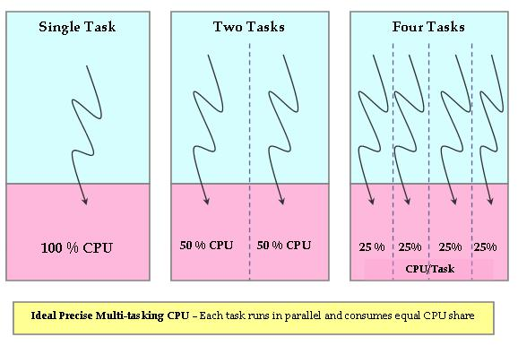

# Topics covered in this lecture

* Mechanism: context switch
* Mechanism: preemption
* Policy: scheduling

This slide deck covers chapters 7--10 in OSTEP.

---

# Reminder: process state transitions

\begin{tikzpicture}

\node [draw, circle, ultra thick, minimum width=2cm] at (0,0) {Blocked};
\node [draw, circle, ultra thick, minimum width=2cm] at (-3,3) {Running};
\node [draw, circle, ultra thick, minimum width=2cm] at (3,3) {Ready};

\draw [ultra thick, ->] (-2.3, 2.3) -- (-0.7, 0.7);
\node at (-2.8, 1.2) {I/O: start};
\draw [ultra thick, ->] (0.7, 0.7) -- (2.3, 2.3);
\node at (2.5, 1.2) {I/O: done};
\draw [ultra thick, ->] (-2, 3.1) -- (2, 3.1);
\node at (0, 3.5) {Deschedule};
\draw [ultra thick, ->] (2, 2.9) -- (-2, 2.9);
\node at (0, 2.5) {Schedule};

\end{tikzpicture}

---

# Mechanism: context switch

A context switch is a mechanism that allows the OS to store the current process
state and switch to some other, previously stored context.

Reasons for a context switch:

* The process completes/exits
* The process executes a slow HW operation (loading from disk) and the OS
  switches to another task that is ready
* The hardware requires OS help and issues an interrupt
* The OS decides to preempt the task and switch to another task (i.e., the
  processes has used up its time slice)

---

# Mechanism: context switch (pseudo code)

* A function call that returns asynchronously: process A starts the execution of
  the context switch but process B continues execution after the return of the
  function.
    * The function saves all registers in a scratch area (on the stack or in
      the `task struct`).
    * The OS switches address spaces.
    * The function restores all registers from a scratch area.
    * The OS returns to process B.

---

# Mechanism: context switch (example, one address space)

```.ASM
# void swtch(struct context *old, struct context *new)
# Save old registers
movl 4(%esp), %eax # put old ptr into eax
popl 0(%eax) # save the old IP
movl %esp, 4(%eax) # and stack
movl %ebx, 8(%eax) # and other registers
...
movl %ebp, 28(%eax)

# Load new registers
movl 4(%esp), %eax # put new ptr into eax
movl 28(%eax), %ebp # restore other registers
...
movl 8(%eax), %ebx
movl 4(%eax), %esp # stack is switched here
pushl 0(%eax) # return addr put in place
ret # finally return into new ctxt
```

---

# Mechanism: preemption

If a task never gives up control (`yield()`), exits, or performs I/O 
then it could run forever and the OS could not gain control.

The OS therefore sets a timer before scheduling a process. If the timer
is up, the hardware switches to the OS where it can decide if the process
may continue.

---

# What is a scheduling policy?

We know *how* we can switch from one process to another, namely by storing its
context and restoring the context of the other process.

The scheduling policy tells us *which* process we should run at any given time.
If there is only one process then the answer is easy. If there are more
processes then the policy decides in which order processes execute.

{ width=100px }

---

# Scheduler metrics

* **Utilization:** what fraction of time is the CPU executing a program (goal: maximize)
* **Turnaround time:** total global time from process creation to process exit (goal: minimize)
* **Response time:** time from becoming ready to being scheduled (goal: minimize)
* **Fairness:** all processes get same amount of CPU over time (goal: no starvation)
* **Progress:** allow processes to make forward progress (goal: minimize kernel interrupts)

---

# Scheduler implementation

```.C
task_struct_t *get_next_task() {
  // consult data structures to find next runnable task
}

void enqueue_task(task_struct_t *task) {
  // set task to runnable
  
  // update run queues so that it can run at its turn
}
```

---

# Scheduling assumptions

Let's understand scheduler policies step by step. We start with some simplifying
assumptions:

* Each job runs for the same amount of time
* All jobs arrive at the same time
* All jobs only use the CPU (no I/O)
* Run-time of jobs is known

---

# First In, First Out (FIFO)

\Begin{multicols}{2}

* Tasks A, B, C of `len=2` arrive at `T=0` (0,2)
* Average turnaround
    * `(2+4+6)/3 = 4`
* Average response
    * `(0+2+4)/3 = 2`

\begin{tikzpicture}[scale=0.5]

\draw [orange, ultra thick] (0,0) rectangle (2,4) node[pos=.5] {A};
\draw [green, ultra thick] (2.1,0) rectangle (4,4) node[pos=.5] {B};
\draw [blue, ultra thick] (4.1,0) rectangle (6,4) node[pos=.5] {C};

\draw [thin, gray, -stealth] (0,0) -- (10,0);
\foreach \x in {0,...,10} {%
    \draw ($(\x,0) + (0,-2pt)$) -- ($(\x,0) + (0,2pt)$)
        node [below] {$\x$};
}
\end{tikzpicture}

\End{multicols}

---

# Scheduling assumptions

* ~~Each job runs for the same amount of time~~
* All jobs arrive at the same time
* All jobs only use the CPU (no I/O)
* Run-time of jobs is known

---

# FIFO challenge: long running task

\Begin{multicols}{2}

* Task A is now of `len=6`
* Average turnaround
    * `(6+8+10)/3 = 8`
* Average response
    * `(0+6+8)/3 = 4.7`
* Turnaround and response time suffers when short jobs wait for long jobs!

\begin{tikzpicture}[scale=0.5]

\draw [orange, ultra thick] (0,0) rectangle (6,4) node[pos=.5] {A};
\draw [green, ultra thick] (6.1,0) rectangle (8,4) node[pos=.5] {B};
\draw [blue, ultra thick] (8.1,0) rectangle (10,4) node[pos=.5] {C};

\draw [thin, gray, -stealth] (0,0) -- (10,0);
\foreach \x in {0,...,10} {%
    \draw ($(\x,0) + (0,-2pt)$) -- ($(\x,0) + (0,2pt)$)
        node [below] {$\x$};
}
\end{tikzpicture}

\End{multicols}

---

# SJF: Shortest Job First

* Long running tasks delay other tasks (convoy effect)
* Short jobs must wait for completion of long task

New scheduler: choose ready job with shortest runtime!

---

# SJF: turnaround

\Begin{multicols}{2}

* Task A is now of `len=6`
* Average turnaround
    * `(2+4+10)/3 = 5.3`
* Average response
    * `(0+2+4)/3 = 2`

\begin{tikzpicture}[scale=0.5]

\draw [green, ultra thick] (0,0) rectangle (2,4) node[pos=.5] {B};
\draw [blue, ultra thick] (2.1,0) rectangle (4,4) node[pos=.5] {C};
\draw [orange, ultra thick] (4.1,0) rectangle (10,4) node[pos=.5] {A};

\draw [thin, gray, -stealth] (0,0) -- (10,0);
\foreach \x in {0,...,10} {%
    \draw ($(\x,0) + (0,-2pt)$) -- ($(\x,0) + (0,2pt)$)
        node [below] {$\x$};
}
\end{tikzpicture}

\End{multicols}

---

# Scheduling assumptions

* ~~Each job runs for the same amount of time~~
* ~~All jobs arrive at the same time~~
* All jobs only use the CPU (no I/O)
* Run-time of jobs is known

---

# SJF: another convoy!

\Begin{multicols}{2}

* Tasks B, C now arrive at 1
* Average turnaround
    * `(6+7+9)/3 = 7.3`
* Average response
    * `(0+5+7)/3 = 4`

\begin{tikzpicture}[scale=0.5]

\draw [orange, ultra thick] (0,0) rectangle (6,4) node[pos=.5] {A};
\draw [green, ultra thick] (6.1,0) rectangle (8,4) node[pos=.5] {B};
\draw [blue, ultra thick] (8.1,0) rectangle (10,4) node[pos=.5] {C};

\draw [thin, gray, -stealth] (0,0) -- (10,0);
\foreach \x in {0,...,10} {%
    \draw ($(\x,0) + (0,-2pt)$) -- ($(\x,0) + (0,2pt)$)
        node [below] {$\x$};
}
\end{tikzpicture}

\End{multicols}

---

# Preemptive scheduling

* Previous schedulers (FIFO, SJF) are non-preemptive. Non-preemptive schedulers
  only switch to another process if the current process gives up the CPU
  voluntarily.
* Preemptive schedulers may take control of the CPU at any time, switching to
  another process according to the scheduling policy.
* New scheduler: shortest time to completion first (STCF), always run the job
  that will complete the fastest.

---

# Preemptive scheduling: STCF

\Begin{multicols}{2}

* Tasks B, C now arrive at 1
* Average turnaround
    * `(2+4+10)/3 = 5.3`
* Average response
    * `(0+0+2)/3 = 0.7`

\begin{tikzpicture}[scale=0.5]

\draw [orange, ultra thick] (0,0) rectangle (1,4) node[pos=.5] {A};
\draw [green, ultra thick] (1.1,0) rectangle (3,4) node[pos=.5] {B};
\draw [blue, ultra thick] (3.1,0) rectangle (5,4) node[pos=.5] {C};
\draw [orange, ultra thick] (5.1,0) rectangle (10,4) node[pos=.5] {A};


\draw [thin, gray, -stealth] (0,0) -- (10,0);
\foreach \x in {0,...,10} {%
    \draw ($(\x,0) + (0,-2pt)$) -- ($(\x,0) + (0,2pt)$)
        node [below] {$\x$};
}
\end{tikzpicture}

\End{multicols}

---

# Next metric: response time

* So far, we have optimized for turnaround time (i.e., completing the tasks as
  fast as possible).

* On an interactive system, response time is equally important, i.e., how long
  it takes until a task is scheduled.

---

# Turnaround versus response time

\Begin{multicols}{2}

* Tasks A (2,0) and B (1, 1)
* B turnaround: 2
* B response time: 1

\begin{tikzpicture}[scale=0.5]

\draw [orange, ultra thick] (0,0) rectangle (2,4) node[pos=.5] {A};
\draw [green, ultra thick] (2.1,0) rectangle (3,4) node[pos=.5] {B};


\draw [thin, gray, -stealth] (0,0) -- (10,0);
\foreach \x in {0,...,10} {%
    \draw ($(\x,0) + (0,-2pt)$) -- ($(\x,0) + (0,2pt)$)
        node [below] {$\x$};
}
\end{tikzpicture}

\End{multicols}


---

# Round robin (RR)

* Previous schedulers optimize for turnaround.

* Optimize response time: alternate ready processes every fixed-length
  time slice.

---

# Round robin

\Begin{multicols}{2}

* Tasks A, B, C (3, 0)
* Average response time
    * (0+1+2)/3 = 1
* Compare to FIFO where average response time is 3

\begin{tikzpicture}[scale=0.5]

\draw [orange, ultra thick] (0,0) rectangle (1,4) node[pos=.5] {A};
\draw [green, ultra thick] (1.1,0) rectangle (2,4) node[pos=.5] {B};
\draw [blue, ultra thick] (2.1,0) rectangle (3,4) node[pos=.5] {C};

\draw [orange, ultra thick] (3.1,0) rectangle (4,4) node[pos=.5] {A};
\draw [green, ultra thick] (4.1,0) rectangle (5,4) node[pos=.5] {B};
\draw [blue, ultra thick] (5.1,0) rectangle (6,4) node[pos=.5] {C};

\draw [orange, ultra thick] (6.1,0) rectangle (7,4) node[pos=.5] {A};
\draw [green, ultra thick] (7.1,0) rectangle (8,4) node[pos=.5] {B};
\draw [blue, ultra thick] (8.1,0) rectangle (9,4) node[pos=.5] {C};


\draw [thin, gray, -stealth] (0,0) -- (10,0);
\foreach \x in {0,...,10} {%
    \draw ($(\x,0) + (0,-2pt)$) -- ($(\x,0) + (0,2pt)$)
        node [below] {$\x$};
}
\end{tikzpicture}

\End{multicols}

---

# Scheduling assumptions

* ~~Each job runs for the same amount of time~~
* ~~All jobs arrive at the same time~~
* ~~All jobs only use the CPU (no I/O)~~
* Run-time of jobs is known

---

# I/O awareness

* So far, the scheduler only considers preemptive events (i.e., the timer runs
  out) or process termination to reschedule.

* If the scheduler is aware of I/O (e.g., loading data from disk) then
  another process can execute until the data is fetched. I/O operations are
  incredibly slow and can be carried out asynchronously (if the scheduler is
  aware).

---

# Scheduling assumptions

* ~~Each job runs for the same amount of time~~
* ~~All jobs arrive at the same time~~
* ~~All jobs only use the CPU (no I/O)~~
* ~~Run-time of jobs is known~~

---

# Advanced scheduling: multi-level feedback queue (MLFQ)

* Goal: general purpose scheduling. Must support both long running background
  tasks (batch processing) and low latency foreground tasks (interactive
  processing).
    * Batch processing: response time not important, cares for long run times
    * Interactive processes: response time critical, short bursts

---

# MLFQ: basics

Approach: multiple levels of round robin; each level has higher priority and
preempts all lower levels. Process at higher level will always be scheduled
first. Set of rules adjusts priorities dynamically.

* Rule 1: if `priority(A) > priority(B)` then A runs.
* Rule 2: if `priority(A) == priority(B)` then A, B run in RR

---

# MLFQ: priority adjustments

Goal: use past behavior as predictor for future behavior.

* Rule 3: processes start at top priority
* Rule 4: if process uses up whole time slice, demote it to lower priority
  (time slices are longer at lower priority)

---

# MLFQ challenges: starvation

Low priority tasks may never run on a busy system.

* Rule 5: periodically boost priority of all tasks that haven't run

---

# MLFQ challenges: gaming

High priority process could yield before its time slice is up, remaining
at high priority.

* Rule 6: account for total time at priority level (and not just time
  of the last time slice), downgrade when threshold is exceeded

---

# MLFQ summary

* Rule 1: if `priority(A) > priority(B)` then A runs.
* Rule 2: if `priority(A) == priority(B)` A, B run in RR
* Rule 3: new processes start with top priority
* Rule 4: if process uses up whole time slice, demote it to lower priority
  (time slices get longer at lower priority)
* Rule 5: periodically boost priority of all tasks that haven't run
* Rule 6: account for total time at priority level (and not just time
  of the last time slice), downgrade when threshold is exceeded

---

# CFS: Completely Fair Scheduler

* Idea: calculate time, processes receive on an ideal processor
* Example: assume 4 processes are ready, so they would receive 1/4 of the
  CPU each (add this time to the book keeping)

{width=350px}

---

# CFS: virtual time

> On real hardware, we can run only a single task at once, so we have to
> introduce the concept of "virtual runtime."  The virtual runtime of a task
> specifies when its next timeslice would start execution on the ideal
> multi-tasking CPU described above.  In practice, the virtual runtime of a task
> is its actual runtime normalized to the total number of running tasks.

* Linux used an O(1) scheduler based on multi-level feedback queues but switched
  to a [completely fair scheduler in 2007](https://www.kernel.org/doc/Documentation/scheduler/sched-design-CFS.txt)

---

# CFS: implementation

* Implementation: keep all processes in a red-black tree, sorted by maximum
  execution time
* Scheduling
    * Schedule leftmost process (the one with the highest balance)
    * If the process exits, remove it from the scheduling tree
    * On interrupt (end of time slice or I/O), reinsert the process into the tree at its new position
    * Repeat

---

# Flexible scheduling


---

# Summary

* Context switch and preemption are fundamental mechanisms that allow the
  OS to remain in control and to implement higher level scheduling policies.
* Schedulers need to optimize for different metrics: utilization, turnaround,
  response time, fairness and forward progress
    * FIFO: simple, non-preemptive scheduler
    * SJF: non-preemptive, prevents process jams
    * STFC: preemptive, prevents jams of late processes
    * RR: preemptive, great response time, bad turnaround
    * MLFQ: preemptive, most realistic
    * CFS: fair scheduler by virtualizing time
* Past behavior is good predictor for future behavior

Don't forget to get your learning feedback through the Moodle quiz!
