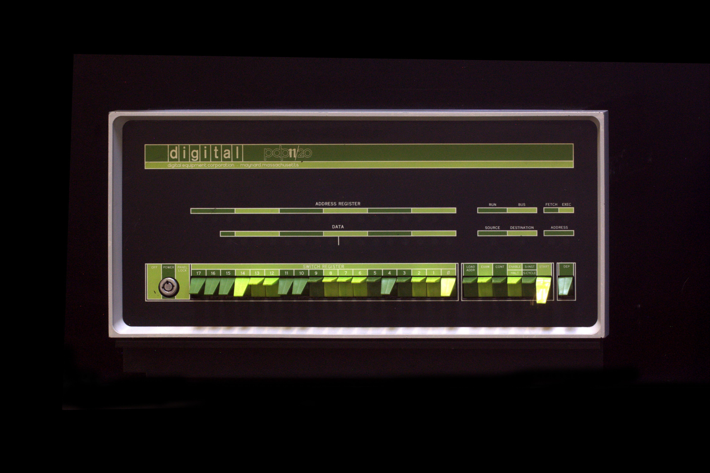
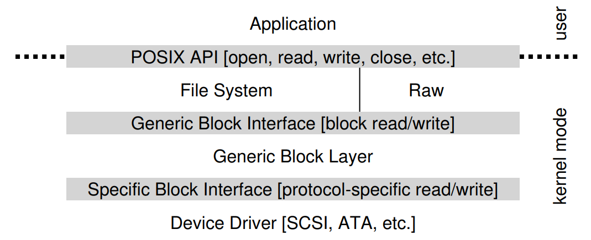

# Persistence

\begin{tikzpicture}
\draw [orange, ultra thick] (0,0) rectangle (2,4);
\node[text width=3cm, rotate=90] at (1, 2.5) {Virtualization};
\draw [blue, ultra thick] (3,0) rectangle (5,4);
\node[text width=3cm, rotate=90] at (4, 2.5) {Concurrency};
\draw [fill, green, ultra thick] (6,0) rectangle (8,4);
\node[text width=3cm, rotate=90] at (7, 2.5) {Persistence};

\draw [red, ultra thick] (0,4.5) -- (8,4.5);
\draw [red, ultra thick] (0,4.5) -- (4,6);
\draw [red, ultra thick] (4,6) -- (8,4.5);
\node[text width=3cm] at (5, 5) {Security};

\end{tikzpicture}

---

# Topics covered in this lecture

* How does the OS interact with devices
* Design of device drivers
* Types of IO devices
* Components of hard drives
* Calculating hard drive throughput
* Scheduling algorithms for IO

This slide deck covers chapters 36, 37 in OSTEP.

---

# Motivation

* So far we have talked about the CPU and about RAM
* How do we get data into RAM?
    * Load programs and data from storage
    * Read and write packets from the network (maybe even streams?)
    * Write data to a terminal or the screen
    * Read data from input devices such as keyboard/mouse/camera
* Devices provide input/output (IO) to a system

* IO allows information to *persist* (RAM is volatile)!
* Enables interesting computation!

---

# Ancient device history

{ width=300px }

* Peripherals connected to UNIBUS
* Each peripheral sets memory area it "listens" to
* No memory protection

---

# Ancient device history

* Each device (not type!) had a unique hardware interface
* Applications contained code to communicate with devices
* Application polled device to set/get information

---

# Modern device interface

* The OS handles device management (and access)
* OS exposes a uniform interface to applications
* IO is interrupt driven

---

# Hardware support for devices: Northbridge

\begin{tikzpicture}

\node [draw, rectangle, ultra thick, minimum width=2cm, minimum height=1cm] at (0,3) {CPU};
\draw [red, ultra thick] (0,2.5) -- (0,2);
\node [draw, rectangle, ultra thick, minimum width=2cm, minimum height=1cm] at (3,3) {RAM};
\draw [red, ultra thick] (3,2.5) -- (3,2);

\draw [red, ultra thick] (-1,2) -- (5,2);
\node at (7.3, 2)   {Northbridge, \textasciitilde 19,600 MB/s};
\node at (6.8, 1.5) {memory bus / PCI-E};

\node [draw, rectangle, ultra thick, minimum width=2cm, minimum height=1cm] at (3,1) {GPU};
\draw [red, ultra thick] (3,1.5) -- (3,2);

\end{tikzpicture}

What about other devices?

---

# Hardware support for devices: Southbridge

\begin{tikzpicture}

\node [draw, rectangle, ultra thick, minimum width=2cm, minimum height=1cm] at (0,3) {CPU};
\draw [red, ultra thick] (0,2.5) -- (0,2);
\node [draw, rectangle, ultra thick, minimum width=2cm, minimum height=1cm] at (3,3) {RAM};
\draw [red, ultra thick] (3,2.5) -- (3,2);


\draw [red, ultra thick] (-1,2) -- (5,2);
\node at (7.3, 2)   {Northbridge, \textasciitilde 19,600 MB/s};
\node at (6.8, 1.5) {memory bus / PCI-E};

\node [draw, rectangle, ultra thick, minimum width=2cm, minimum height=1cm] at (3,1) {GPU};
\draw [red, ultra thick] (3,1.5) -- (3,2);

\draw [orange, ultra thick] (-1,0) -- (5,0);
\node at (7.15, 0)    {Southbridge \textasciitilde 4,000 MB/s};
\node at (6.65, -0.5) {I/O bus (e.g., PCI)};

\draw [orange, ultra thick] (1.5,0) -- (1.5,2);

\node [draw, rectangle, ultra thick, minimum width=2cm, minimum height=1cm] at (0,1) {PCI Dev};
\draw [orange, ultra thick] (0,0.5) -- (0,0);

\end{tikzpicture}

What about "slow" IO?

---

# Hardware support for devices: Other IO

\begin{tikzpicture}

\node [draw, rectangle, ultra thick, minimum width=2cm, minimum height=1cm] at (0,3) {CPU};
\draw [red, ultra thick] (0,2.5) -- (0,2);
\node [draw, rectangle, ultra thick, minimum width=2cm, minimum height=1cm] at (3,3) {RAM};
\draw [red, ultra thick] (3,2.5) -- (3,2);


\draw [red, ultra thick] (-1,2) -- (5,2);
\node at (7.3, 2)   {Northbridge, \textasciitilde 19,600 MB/s};
\node at (6.8, 1.5) {memory bus / PCI-E};

\node [draw, rectangle, ultra thick, minimum width=2cm, minimum height=1cm] at (3,1) {GPU};
\draw [red, ultra thick] (3,1.5) -- (3,2);

\draw [orange, ultra thick] (-1,0) -- (5,0);
\node at (7.15, 0)    {Southbridge \textasciitilde 4,000 MB/s};
\node at (6.65, -0.5) {I/O bus (e.g., PCI)};

\draw [orange, ultra thick] (1.5,0) -- (1.5,2);

\node [draw, rectangle, ultra thick, minimum width=2cm, minimum height=1cm] at (0,1) {PCI Dev};
\draw [orange, ultra thick] (0,0.5) -- (0,0);


\draw [yellow, ultra thick] (-1,-2) -- (5,-2);
\node at (7.8, -2) {Peripheral I/O bus, \textasciitilde 2,000 MB/s};
\node at (6.7, -2.5) {(e.g., SATA, USB)};

\draw [yellow, ultra thick] (1.5,-2) -- (1.5,0);

\node [draw, rectangle, ultra thick, minimum width=1cm, minimum height=1cm] at (0,-1) {HDD};
\draw [yellow, ultra thick] (0,-1.5) -- (0,-2);

\node [draw, rectangle, ultra thick, minimum width=1cm, minimum height=1cm] at (2.5,-1) {Cam};
\draw [yellow, ultra thick] (2.5,-1.5) -- (2.5,-2);

\node [draw, rectangle, ultra thick, minimum width=1cm, minimum height=1cm] at (4,-1) {WiFi};
\draw [yellow, ultra thick] (4,-1.5) -- (4,-2);

\end{tikzpicture}

---

# Terminology

* Northbridge is also called memory controller hub
* Southbridge is also called I/O Controller Hub (ICH / Intel) or Fusion Controller Hub (FCH / AMD)
* The southbridge is connected to the CPU through the northbridge which has a direct connection

. . .

But how do devices work?

---

# Canonical device (1/2)

\begin{tikzpicture}

\node [draw, rectangle, ultra thick, minimum width=6cm, minimum height=4cm] at (0,3) {};
\node [draw, rectangle, ultra thick, minimum width=2cm, minimum height=0.8cm] at (-1.5,4.6) {Status};
\node [draw, rectangle, ultra thick, minimum width=1cm, minimum height=0.8cm] at (0.5,4.6) {CMD};
\node [draw, rectangle, ultra thick, minimum width=1cm, minimum height=0.8cm] at (2,4.6) {DTA};
\node at (5, 4.6) {(Device registers)};

\draw [red, ultra thick, dotted] (-2.95,4) -- (2.95,4);

\node at (5, 3.6) {(Device internals)};

\end{tikzpicture}

* OS writes device registers (by executing CPU instructions)
* Device internals are hidden (abstraction)

---

# Canonical device (2/2)

\begin{tikzpicture}

\node [draw, rectangle, ultra thick, minimum width=6cm, minimum height=4cm] at (0,3) {};
\node [draw, rectangle, ultra thick, minimum width=2cm, minimum height=0.8cm] at (-1.5,4.6) {Status};
\node [draw, rectangle, ultra thick, minimum width=1cm, minimum height=0.8cm] at (0.5,4.6) {CMD};
\node [draw, rectangle, ultra thick, minimum width=1cm, minimum height=0.8cm] at (2,4.6) {DTA};
\node at (5, 4.6) {(Device registers)};

\draw [red, ultra thick, dotted] (-2.95,4) -- (2.95,4);

\node at (0, 3) {Microcontroller (CPU+RAM)};
\node at (0, 2.3) {Storage (ROM/Flash)};
\node at (0, 1.6) {Special purpose chips};

\node at (5, 3.6) {(Device internals)};

\end{tikzpicture}

* OS communicates based on agreed protocol (through "driver")
* Device signals OS through memory or interrupt

---

# Device protocol (1/3)

```.C
while (STATUS == BUSY) ; // 1. spin
// 2. Write data to DTA register
*dtaRegister = DATA;
// 3. Write command to CMD register
*cmdRegister = COMMAND;
while (STATUS == BUSY) ; // 4. spin
```

* Wait until device is ready
* Set data and command (why send data first?)
* Wait until command has completed

. . .

Where do you see problems?

---

# Device protocol (2/3)

\begin{tikzpicture}

\draw [decorate,decoration={brace,amplitude=4pt}] (0.5,0.5) -- (2,0.5) node[midway,yshift=1em]{1};
\draw [decorate,decoration={brace,amplitude=4pt}] (2,0.5) -- (2.5,0.5) node[midway,yshift=1em]{2};
\draw[<-] (2.5,0.4) -- (2.5,1) node[midway,yshift=1.3em]{3};
\draw [decorate,decoration={brace,amplitude=4pt}] (2.5,0.5) -- (4,0.5) node[midway,yshift=1em]{4};

\node [draw, rectangle, fill, color=cyan, minimum width=5cm, minimum height=0.8cm, text=black] at (2.5,0) {A};
\node [draw, rectangle, fill, color=green, minimum width=2cm, minimum height=0.8cm, text=black] at (6,0) {B};
\node at (-1,0) {CPU};

\node [draw, rectangle, fill, color=teal, minimum width=2cm, minimum height=0.8cm, text=black] at (1,-1) {C};
\node [draw, rectangle, fill, color=cyan, minimum width=2cm, minimum height=0.8cm, text=black] at (3,-1) {A};

\node at (-1,-1) {Disk};


\end{tikzpicture}

. . .

* Busy waiting (1. and 4.) wastes cycles twice
* CPU should not need to wait for completion of command
* Solution: embrace asynchronous communication
    * Inform device of request (to get rid of 1.)
    * Wait for signal of completion (to get rid of 4.)

---

# Device protocol (3/3): interrupts

\begin{tikzpicture}

%\draw [decorate,decoration={brace,amplitude=4pt}] (0.5,0.5) -- (2,0.5) node[midway,yshift=1em]{1};
\draw[<-] (0.5,0.4) -- (0.5,1) node[midway,yshift=1.3em]{1};
\draw [decorate,decoration={brace,amplitude=4pt}] (2,0.5) -- (2.5,0.5) node[midway,yshift=1em]{2};
\draw[<-] (2.5,0.4) -- (2.5,1) node[midway,yshift=1.3em]{3};
%\draw [decorate,decoration={brace,amplitude=4pt}] (2.5,0.5) -- (4,0.5) node[midway,yshift=1em]{4};
\draw[<-] (4,0.4) -- (4,1) node[midway,yshift=1.3em]{4};

%\draw [cyan, ultra thick] (0,-0.4) rectangle (2,0.4) node[midway] {A};
\node [draw, rectangle, fill, color=cyan, minimum width=0.5cm, minimum height=0.8cm, text=black] at (0.25,0) {A};
\node [draw, rectangle, fill, color=green, minimum width=1.5cm, minimum height=0.8cm, text=black] at (1.25,0) {B};
\node [draw, rectangle, fill, color=cyan, minimum width=0.5cm, minimum height=0.8cm, text=black] at (2.25,0) {A};
\node [draw, rectangle, fill, color=green, minimum width=1.5cm, minimum height=0.8cm, text=black] at (3.25,0) {B};
\node [draw, rectangle, fill, color=cyan, minimum width=1cm, minimum height=0.8cm, text=black] at (4.5,0) {A};
\node at (-1,0) {CPU};

\node [draw, rectangle, fill, color=teal, minimum width=2cm, minimum height=0.8cm, text=black] at (1,-1) {C};
\node [draw, rectangle, fill, color=cyan, minimum width=2cm, minimum height=0.8cm, text=black] at (3,-1) {A};

\node at (-1,-1) {Disk};


\end{tikzpicture}

* Instead of spinning, the OS (driver) waits for an interrupt
    * Interrupts are handled centrally through a dispatcher
    * On interrupt arrival, wake up kernel thread that waits on that interrupt

---

# Interrupt performance

* Can interrupts lead to worse performance than polling?

. . .

* Yes: livelock (e.g., a flood of arriving network packets)
    * A livelock is *similar to a deadlock* (no process makes progress, resulting
      in starvation) with the difference that the states of the processes
      constantly change
    * For example: network packets arrive; interrupt handling
      and context switch is costly, prohibiting the application from reacting to
      the packets and them simply queuing up.

. . .

* Real systems therefore use a mix between polling and interrupts
    * Interrupts allow overlap between computation and IO, most useful for slow devices;
    * Use polling for short bursts or small amounts of data
* Another optimization is *coalescing*, i.e., the device waits for a bit until more
  requests complete, then batch sends everything.

---

# Optimize data transfer

\begin{tikzpicture}

%\draw [decorate,decoration={brace,amplitude=4pt}] (0.5,0.5) -- (2,0.5) node[midway,yshift=1em]{1};
\draw[<-] (0.5,0.4) -- (0.5,1) node[midway,yshift=1.3em]{1};
\draw [color=red,line width=0.5mm,decorate,decoration={brace,amplitude=4pt}] (2,0.5) -- (2.5,0.5) node[midway,yshift=1em]{2};
\draw[<-] (2.5,0.4) -- (2.5,1) node[midway,yshift=1.3em]{3};
%\draw [decorate,decoration={brace,amplitude=4pt}] (2.5,0.5) -- (4,0.5) node[midway,yshift=1em]{4};
\draw[<-] (4,0.4) -- (4,1) node[midway,yshift=1.3em]{4};

%\draw [cyan, ultra thick] (0,-0.4) rectangle (2,0.4) node[midway] {A};
\node [draw, rectangle, fill, color=cyan, minimum width=0.5cm, minimum height=0.8cm, text=black] at (0.25,0) {A};
\node [draw, rectangle, fill, color=green, minimum width=1.5cm, minimum height=0.8cm, text=black] at (1.25,0) {B};
\node [draw, rectangle, fill, color=cyan, minimum width=0.5cm, minimum height=0.8cm, text=black] at (2.25,0) {A};
\node [draw, rectangle, fill, color=green, minimum width=1.5cm, minimum height=0.8cm, text=black] at (3.25,0) {B};
\node [draw, rectangle, fill, color=cyan, minimum width=1cm, minimum height=0.8cm, text=black] at (4.5,0) {A};
\node at (-1,0) {CPU};

\node [draw, rectangle, fill, color=teal, minimum width=2cm, minimum height=0.8cm, text=black] at (1,-1) {C};
\node [draw, rectangle, fill, color=cyan, minimum width=2cm, minimum height=0.8cm, text=black] at (3,-1) {A};

\node at (-1,-1) {Disk};

\end{tikzpicture}

* **PIO (Programmed IO)**: CPU tells the device *what* data
    * One instruction for each byte/word
    * Efficient for a few bytes, scales terribly

. . .

* **DMA (Direct Memory Access)**: tell device *where* data *is*
    * One instruction to send a pointer
    * Efficient for large data transfers

---

# How to transfer data?

* IO ports
    * Each device has an assigned IO port
    * Special instructions (`in`/`out` on x86) communicate with device
* Memory mapped IO
    * Device maps its registers to memory
    * Loads/stores interact with device

. . .

* Both are used in practice. Architectures now support both. Differences are a matter of choice and preference.

---

# Support for different devices

* Challenge: different devices have *different protocols*
* Drivers are specialized pieces of code for a particular device
    * Low end communicates with the device
    * High end exposes generic interface to OS

. . .

* Drivers are an example of *encapsulation*
    * Different drivers adhere to the same API
    * OS only implements support for APIs based on device class
* Requirement: well-designed interface/API
    * Trade-off between versatility and over-specialization
    * Due to device class complexity, OS ends with layers of APIs

---

# Complexity of API layers

{width=400px}

---

# IO subsystem: hard disks

* Disk has a sector-addressable address space
* Sectors are 512 or 4096 bytes
* Main operations: read/write

---

# Hard disk

\begin{tikzpicture}

\node [draw, circle, ultra thick, minimum width=1cm] at (0,0) {};
\node [draw, circle, ultra thick, minimum width=2cm] at (0,0) {};
\node [draw, circle, ultra thick, minimum width=3cm] at (0,0) {};
\node [draw, circle, ultra thick, minimum width=4cm] at (0,0) {};
\node [draw, circle, ultra thick, minimum width=5cm] at (0,0) {};
\node [draw, circle, ultra thick, minimum width=6cm] at (0,0) {};

\draw [ultra thick] (-3,0) -- (3,0);
\draw [ultra thick] (0,-3) -- (0,3);
\draw [ultra thick, rotate=45] (0,-3) -- (0,3);
\draw [ultra thick, rotate=135] (0,-3) -- (0,3);


\node [draw, fill, color=teal, rectangle, ultra thick, minimum width=4cm, minimum height=0.3cm, rotate=-44] at (3.05,0.2) {};
\node [color=red, thick] at (1.85,1.4) {A};

\end{tikzpicture}

* IO cost is sum of:
    * seek time (adjust angle of reader)
    * rotation time (rotate the start of the sector to the reader)
    * transfer time (rotate sector under reader)

---

# Disc drives

\begin{tikzpicture}

\node [draw, circle, ultra thick, minimum width=1cm] at (0,0) {};
\node [draw, circle, ultra thick, minimum width=2cm] at (0,0) {};
\node [draw, circle, ultra thick, minimum width=3cm] at (0,0) {};
\node [draw, circle, ultra thick, minimum width=4cm] at (0,0) {};
\node [draw, circle, ultra thick, minimum width=5cm] at (0,0) {};
\node [draw, circle, ultra thick, minimum width=6cm] at (0,0) {};

\draw [ultra thick] (-3,0) -- (3,0);
\draw [ultra thick] (0,-3) -- (0,3);
\draw [ultra thick, rotate=45] (0,-3) -- (0,3);
\draw [ultra thick, rotate=135] (0,-3) -- (0,3);


\node [draw, fill, color=teal, rectangle, ultra thick, minimum width=4cm, minimum height=0.3cm, rotate=-44] at (3.05,0.2) {};
\node [color=red, thick] at (1.85,1.4) {A};

\end{tikzpicture}

* [Hard drive spinning up](https://www.youtube.com/watch?v=D-EtrC32wrU)
* [Open hard drive spinning up](https://www.youtube.com/watch?v=zMpa4h_SRmI)
* [How floppy drives work](https://www.youtube.com/watch?v=EHRc-QMoUE4)
* [Alternate use for floppy drives](https://www.youtube.com/watch?v=Oym7B7YidKs)

---

# HDD: seek, rotate, transfer

* Seek is costly (several ms, "an eternity")
    * function of cylinder distance
    * operations: accelerate, coast, decelerate, settle
* Rotate: 7200 RPM, 8.3 ms/rotation
* Transfer: (100MB/s): 5 us for 512 B

. . .

* Seeks and rotation is slow, transfer is fast
    * Sequential access is much faster (blocks are ordered)
    * Random access is slow

---

# IO scheduling

* Given concurrent IO requests, how should they be scheduled?
    * Different constraints than CPU scheduling
    * ... but the same algorithms!

. . .


* Position of disk head relative to requested position matters more than length of the transfer

---

# Optimization: buffering

* A buffer cache between the disk and the higher level of the OS keeps most recently used disk blocks around
* Proactively fetches blocks that are likely accessed
* Keep track of dirty blocks that need to be written back

---

# First come first serve

* Assume 10ms average seek and rotation time
* Requests: 30001, 70001, 30002, 70002, 30003, 70003: 60ms
    * How can we improve?

. . .

* Requests: 30001, 30002, 30003, 70001, 70002, 70003: 20ms
    * Shortest seek time: seek to closest block (minding starvation)
    * Elevator/SCAN: go outwards/inwards, serve requests along
    * Clever optimizations of shortest seek time/elevator

---

# Completely fair queuing (Linux)

* Queue for each process
* Weighted round-robin between queues with slice-time proportional to priority
* Yield slice only if idle for given time

. . .

Scheduling algorithms for CPU time are also useful for I/O

---

# Going beyond one disk

* A single disk has many limitations
    * Single point of failure
    * Limited performance
    * Limited size
* File systems work on a single disk (or partition)
* How can we increase flexibility?

. . .

* One more layer of indirection: a virtual disk!

---

# RAID: Redundant Array of Inexpensive Disks

* Idea: build logical disk from (many) physical disks

. . .

* RAID0: Striping (no mirroring or parity)
    * n performance, n capacity, 0/n can fail
* RAID1: Data mirroring (no parity or striping)
    * n performance, (n-1)/n can fail
* RAID2: bit level striping (historic, sync'd, one parity drive)
* RAID3: byte level striping (historic, sync'd, one parity drive)
* RAID4: block level striping (historic, one drive holds parity)
* RAID5: block level striping, distributed parity
    * n performance, n-1 capacity, 1/n can fail
* RAID6: block level striping, distributed parity
    * n performance, n-2 capacity, 2/n can fail

---

# RAID: combinations

* RAID 01: two stripes (RAID0) that are mirrored (RAID1)
* RAID 10: stripe (RAID0) a set of mirrored devices (RAID1)
* Which one is more reliable?

---

# RAID 01

\begin{tikzpicture}[level distance=1.5cm,
  level 1/.style={sibling distance=4cm},
  level 2/.style={sibling distance=1.5cm}]
  \node {RAID 1}
    child {node {RAID 0}
      child {node {D0}}
      child {node {D1}}
      child {node {D2}}
    }
    child {node {RAID 0}
      child {node {D3}}
      child {node {D4}}
      child {node {D5}}
    };

\end{tikzpicture}

. . .

* During rebuild (a disk has failed), no other drive from the *alternate* group may fail
* Given D0 fails, if any of D3, D4, or D5 fails the system halts (3/5)
* Given D0 fails, if D3 fails the system is dead (1/5)

---

# RAID 10

\begin{tikzpicture}[level distance=1.5cm,
  level 1/.style={sibling distance=4cm},
  level 2/.style={sibling distance=1.5cm}]
  \node {RAID 0}
    child {node {RAID 1}
      child {node {D0}}
      child {node {D1}}
    }
    child {node {RAID 1}
      child {node {D2}}
      child {node {D3}}
    }
    child {node {RAID 1}
      child {node {D4}}
      child {node {D5}}
    };

\end{tikzpicture}

* Of each mirror, at least one disk must remain healthy
* Given D0 fails, if D1 fails the system is dead (1/5)
* Given D0 fails, any other disk (except D1) may fail without impact (1/5)

---

# Summary

* Overlap IO and computation as much as possible!
    * Use interrupts
    * Use DMA
* Driver classes provide common interface
* Storage: read/write/seek of blocks
* Minimize random IO (i.e., quick sort is really bad on HDDs)
* Carefully schedule IO on slow devices
* RAID virtualizes disks

Don't forget to get your learning feedback through the Moodle quiz!
