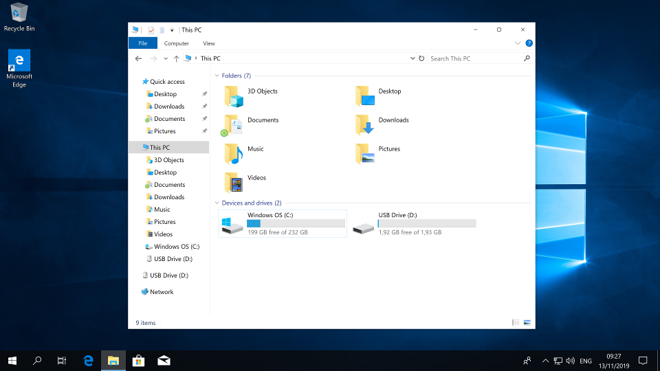

---

# Topics covered in this lecture

* Filesystem API
* Internal and external interface
* Inodes and devices
* File descriptors
* File names

This slide deck covers chapters 39, 40 in OSTEP.

---

# Purpose of a file system (1/2)

* Given: set of persistent blocks
* Goal: manage these blocks efficiently. How?

. . .

* Manages data on (usually) nonvolatile storage
* Enables users to name and manipulate semi-permanent files
* Provide mechanisms to organize files and their metadata (e.g., owner, permissions, or type)

---

# Purpose of a file system (2/2)

* Map bytes on disk to "file"
* Share files (concurrently?) among users and processes
    * Decide on locking granularity and binding operations
    * Semantics of operations like truncating in a shared world
* File caching: metadata and contents

---

# Sharing and concurrency is hard!

* Consider file permissions change *after* file is opened
* Consider a file is moved *after* it is opened
* Consider file owner changes *after* it is opened
* A process forks, what happens to open files (e.g., read position in file)
* What happens if two processes concurrently write to the same file?
* ...

---

# The `file` abstraction

* A file is a linear persistent array of bytes
    * Operations: read or write
    * Metaoperations: create, delete, modify permissions/user/...
* Different perspectives
    * File name (human readable)
    * Inode and device number (persistent ID)
    * File descriptor (process view)
* Directory contains subdirectories
    * List of directories, files, inode mappings

---

# The I/O hierarchy

\begin{tikzpicture}
\node (A) at (0,4) [draw,yellow,ultra thick,minimum width=2cm,minimum height=1cm] {File Naming};
\node (A) at (0,3) [draw,orange,ultra thick,minimum width=3cm,minimum height=1cm] {Directory Access};
\node (A) at (0,2) [draw,red,ultra thick,minimum width=4cm,minimum height=1cm] {File Access};
\node (A) at (0,1) [draw,teal,ultra thick,minimum width=5cm,minimum height=1cm] {Disk Device Driver};
\node (A) at (0,0) [draw,gray,ultra thick,minimum width=6cm,minimum height=1cm] {Disk Hardware};
\end{tikzpicture}

* Each level adds functionality (and complexity)

---

# Different functionality

* Naming: specifies name syntax and encoding, e.g., a URL; may be aware if a file is local/remote
* Directory access: map name to file object (resolves a string to an object)
* File access: concerns file operations such as create/delete/read/write

---

# Different file philosophies

* Typed files: associate structure
    * System defines *all* possible file types (e.g., text document, source file, html file)
    * File type set at creation, file type specifies operations
* Untyped files: array of bytes
    * File is a sequence of bytes
    * System does neither understand nor care about contents
    * File operations apply to all files

. . .

Modern systems all use untyped files.

---

# Desired file operations

* `create`: create a new file
* `unlink`: remove/destroy a file
* `open`: map a path to a file identifier
* `close`: close a file identifier
* `read`: read from the current file position
* `write`: write to the current file position
* `seek`: modify the file position
* `control`: various control operations such as changing permissions or user
* `createdir`: create a new directory
* `rmdir`: remove a directory
* `readdir`: return all files in a directory

---

# Desired cost of file operations

* Sequential read/write is common, target O(size of transfer)
* Random access (seeking) is infrequent, target O(log file length)

. . .

* Constraints and observations
    * Many files are small
    * A few files are large
    * Most access is sequential, few accesses are at random positions
* Ideas for a clever data structure?

---

# The 3 views of a file

* **Operating system:** Inode and device id
    * Ids are unique and great and unambiguous
* User: file name
* Process: File descriptor

---

# Managing files: inodes

* An `inode` contains metadata of a file
* Each file has exactly one associated inode
* Each inode is unique on a filesystem (not globally!)
* Inodes are recycled after reuse

. . .

* Note: multiple file names may map to the same inode (see "hard links")

---

# Table of inodes (1/2)

\begin{tikzpicture}
\node at (-1.2, 4.5) {0};
\node (I1) at (0,4.5) [draw,black,ultra thick,minimum width=2cm,minimum height=1.5cm] {\begin{tabular}{l}location \\ size=18\end{tabular}};
\node at (-1.2, 3) {1};
\node (I2) at (0,3) [draw,black,ultra thick,minimum width=2cm,minimum height=1.5cm] {\begin{tabular}{l}location \\ size\end{tabular}};
\node at (-1.2, 1.5) {2};
\node (I3) at (0,1.5) [draw,black,ultra thick,minimum width=2cm,minimum height=1.5cm] {\begin{tabular}{l}location \\ size=12\end{tabular}};
\node at (-1.2, 0) {3};
\node (I4) at (0,0) [draw,black,ultra thick,minimum width=2cm,minimum height=1.5cm] {\begin{tabular}{l}location \\ size=12\end{tabular}};
\node (M) at (0,-1) {Metadata};

\node (F1) at (7,4) [draw,ultra thick, fill=gray, rectangle,minimum width=6cm, minimum height=0.5cm] {data F1};
\node (F2) at (6,2) [draw,ultra thick, fill=gray, rectangle,minimum width=4cm, minimum height=0.5cm] {data F2};
\node (F3) at (6,0) [draw,ultra thick, fill=gray, rectangle,minimum width=4cm, minimum height=0.5cm] {data F3};

\draw [ultra thick, ->] (0.8, 4.8) -- (4, 4);
\draw [ultra thick, ->] (0.8, 1.8) -- (4, 2);
\draw [ultra thick, ->] (0.8, 0.3) -- (4, 0);

\end{tikzpicture}

---

# Table of inodes (2/2)

* Storage space is split into fixed size inode table and data storage
* Files are statically allocated
* Need to remember inode number to access file content

. . .

Idea: use a dedicated special file to store a mapping from file names to inodes

---

# The 3 views of a file

* **Operating system:** Inode and device id
* **User:** file name
    * Humans are better at remembering names than numbers
* Process: File descriptor

---

# From path to inode (1/2)

\begin{tikzpicture}
\node at (-1.2, 4.5) {0};
\node (I1) at (0,4.5) [draw,black,ultra thick,minimum width=2cm,minimum height=1.5cm] {\begin{tabular}{l}location \\ size=18\end{tabular}};
\node at (-1.2, 3) {1};
\node (I2) at (0,3) [draw,black,ultra thick,minimum width=2cm,minimum height=1.5cm] {\begin{tabular}{l}location \\ size\end{tabular}};
\node at (-1.2, 1.5) {2};
\node (I3) at (0,1.5) [draw,black,ultra thick,minimum width=2cm,minimum height=1.5cm] {\begin{tabular}{l}location \\ size=12\end{tabular}};
\node at (-1.2, 0) {3};
\node (I4) at (0,0) [draw,black,ultra thick,minimum width=2cm,minimum height=1.5cm] {\begin{tabular}{l}location \\ size=12\end{tabular}};
\node (M) at (0,-1) {Metadata};

\node (F1) at (7,4) [draw,ultra thick, fill=gray, rectangle,minimum width=6cm, minimum height=0.5cm] {'tmp': 2, 'etc': 15, ...};
\node (F2) at (6,2) [draw,ultra thick, fill=gray, rectangle,minimum width=4cm, minimum height=0.5cm] {'test.txt': 3};
\node (F3) at (6,0) [draw,ultra thick, fill=gray, rectangle,minimum width=4cm, minimum height=0.5cm] {'Hello World!'};

\draw [ultra thick, ->] (0.8, 4.8) -- (4, 4);
\draw [ultra thick, ->] (0.8, 1.8) -- (4, 2);
\draw [ultra thick, ->] (0.8, 0.3) -- (4, 0);

\draw [ultra thick, ->] (6, 3.7) -- (1, 2);
\draw [ultra thick, ->] (6, 1.7) -- (1, 0.5);

\end{tikzpicture}

---

# From path to inode (2/2)

* A special file stores mapping between file names and inodes
* Extend to hierarchy: mark if a file name is a directory or a regular file
    * Access to '/tmp/test.txt' in 3 steps: 'tmp', 'test.txt', contents
* What data should you store in the directory file (compared to the inode)?

---

# Special directory entries: `.` and `..`

```
$ ls -al
total 180
drwxr-xr-x 6 gannimo gannimo  4096 Nov  6 11:54 .
drwxr-xr-x 5 gannimo gannimo  4096 Oct 28 09:50 ..
-rw-r--r-- 1 gannimo gannimo  5978 Sep 30 09:28 00-intr.md
-rw-r--r-- 1 gannimo gannimo 12430 Nov  6 11:54 11-proc.md
-rw-r--r-- 1 gannimo gannimo 15071 Nov  6 11:54 12-sche.md
-rw-r--r-- 1 gannimo gannimo 13157 Oct 21 10:55 13-segm.md
-rw-r--r-- 1 gannimo gannimo 14824 Oct 17 09:51 14-page.md
```

* '`.`'' maps to the current, '`..`'' maps to the next higher directory

---

# The 3 views of a file

* **Operating system:** Inode and device id
* **User:** file name
* **Process:** File descriptor
    * Keep track of per-process state (e.g., read position or name, inode mapping)

---

# File descriptor (1/4)

* The combination of file names and inode/device id are sufficient to implement persistent storage
* Drawback: constant lookups from file name to inode/device id are costly
* Idea: do expensive tree traversal once, store final inode/device number in a per-process table
    * Also keep additional information such as file offset
    * Per process table of open files
    * Use linear numbers (fd 0, 1, 2, ...), reuse when freed

---

# File descriptor (2/4)

\begin{tikzpicture}
\node at (0, 5) {fd table};
\node (I1) at (0,4.5) [draw,black,ultra thick,minimum width=1cm,minimum height=0.5cm] {};
\node at (-0.8, 4.5) {0};
\node (I1) at (0,4) [draw,black,ultra thick,minimum width=1cm,minimum height=0.5cm] {};
\node at (-0.8, 4) {1};
\node (I1) at (0,3.5) [draw,black,ultra thick,minimum width=1cm,minimum height=0.5cm] {};
\node at (-0.8, 3.5) {2};
\node (I1) at (0,3) [draw,black,ultra thick,minimum width=1cm,minimum height=0.5cm] {};
\node at (-0.8, 3) {3};
\node (I1) at (0,2.5) [draw,black,ultra thick,minimum width=1cm,minimum height=0.5cm] {};
\node at (-0.8, 2.5) {4};
\node (I1) at (0,2) [draw,black,ultra thick,minimum width=1cm,minimum height=0.5cm] {};
\node at (-0.8, 2) {5};

\node (I1) at (4,4.5) [draw,black,ultra thick,minimum width=2cm,minimum height=1.5cm] {\begin{tabular}{l}offset=0 \\ inode= \\ device= \end{tabular}};

\node (I2) at (8,3) [draw,black,ultra thick,minimum width=2cm,minimum height=1.5cm] {\begin{tabular}{l}location= \\ size=\end{tabular}};

\draw [ultra thick, ->](0.5,3) -- (2.93, 5.3);
\draw [ultra thick, ->](4.8,4.3) -- (6.8, 3.7);

\end{tikzpicture}

```.C
int fd1 = open("file.txt");  // returns 3
read(fd1, buf, 23);
```

---

# File descriptor (3/4)

\begin{tikzpicture}
\node at (0, 5) {fd table};
\node (I1) at (0,4.5) [draw,black,ultra thick,minimum width=1cm,minimum height=0.5cm] {};
\node at (-0.8, 4.5) {0};
\node (I1) at (0,4) [draw,black,ultra thick,minimum width=1cm,minimum height=0.5cm] {};
\node at (-0.8, 4) {1};
\node (I1) at (0,3.5) [draw,black,ultra thick,minimum width=1cm,minimum height=0.5cm] {};
\node at (-0.8, 3.5) {2};
\node (I1) at (0,3) [draw,black,ultra thick,minimum width=1cm,minimum height=0.5cm] {};
\node at (-0.8, 3) {3};
\node (I1) at (0,2.5) [draw,black,ultra thick,minimum width=1cm,minimum height=0.5cm] {};
\node at (-0.8, 2.5) {4};
\node (I1) at (0,2) [draw,black,ultra thick,minimum width=1cm,minimum height=0.5cm] {};
\node at (-0.8, 2) {5};

\node (I1) at (4,4.5) [draw,black,ultra thick,minimum width=2cm,minimum height=1.5cm] {\begin{tabular}{l}offset=0 \\ inode= \\ device= \end{tabular}};

\node (I2) at (8,3) [draw,black,ultra thick,minimum width=2cm,minimum height=1.5cm] {\begin{tabular}{l}location= \\ size=\end{tabular}};
\draw [ultra thick, ->](0.5,3) -- (2.93, 5.3);
\draw [ultra thick, ->](4.8,4.3) -- (6.8, 3.7);

\node (I1) at (4,2.5) [draw,black,ultra thick,minimum width=2cm,minimum height=1.5cm] {\begin{tabular}{l}offset=0 \\ inode= \\ device= \end{tabular}};
\draw [ultra thick, ->](0.5,2.5) -- (2.93, 3.3);
\draw [ultra thick, ->](4.8,2.3) -- (6.8, 3.7);


\end{tikzpicture}

```.C
int fd1 = open("file.txt");  // returns 3
read(fd1, buf, 23);
int fd2 = open("file.txt");  // returns 4
```

---

# File descriptor (4/4)

\begin{tikzpicture}
\node at (0, 5) {fd table};
\node (I1) at (0,4.5) [draw,black,ultra thick,minimum width=1cm,minimum height=0.5cm] {};
\node at (-0.8, 4.5) {0};
\node (I1) at (0,4) [draw,black,ultra thick,minimum width=1cm,minimum height=0.5cm] {};
\node at (-0.8, 4) {1};
\node (I1) at (0,3.5) [draw,black,ultra thick,minimum width=1cm,minimum height=0.5cm] {};
\node at (-0.8, 3.5) {2};
\node (I1) at (0,3) [draw,black,ultra thick,minimum width=1cm,minimum height=0.5cm] {};
\node at (-0.8, 3) {3};
\node (I1) at (0,2.5) [draw,black,ultra thick,minimum width=1cm,minimum height=0.5cm] {};
\node at (-0.8, 2.5) {4};
\node (I1) at (0,2) [draw,black,ultra thick,minimum width=1cm,minimum height=0.5cm] {};
\node at (-0.8, 2) {5};

\node (I1) at (4,4.5) [draw,black,ultra thick,minimum width=2cm,minimum height=1.5cm] {\begin{tabular}{l}offset=0 \\ inode= \\ device= \end{tabular}};

\node (I2) at (8,3) [draw,black,ultra thick,minimum width=2cm,minimum height=1.5cm] {\begin{tabular}{l}location= \\ size=\end{tabular}};
\draw [ultra thick, ->](0.5,3) -- (2.93, 5.3);
\draw [ultra thick, ->](4.8,4.3) -- (6.8, 3.7);

\node (I1) at (4,2.5) [draw,black,ultra thick,minimum width=2cm,minimum height=1.5cm] {\begin{tabular}{l}offset=0 \\ inode= \\ device= \end{tabular}};
\draw [ultra thick, ->](0.5,2.5) -- (2.93, 3.3);
\draw [ultra thick, ->](0.5,2) -- (2.93, 3.3);
\draw [ultra thick, ->](4.8,2.3) -- (6.8, 3.7);


\end{tikzpicture}

```.C
int fd1 = open("file.txt");  // returns 3
read(fd1, buf, 23);
int fd2 = open("file.txt");  // returns 4
int fd3 = dup(fd2);          // returns 5
```

---

# File API

* `int open(char *path, int flag, mode_t mode)`
* `size_t read(int fd, char *buf, size_t nbyte)`
* `size_t write(int fd, char *buf, size_t nbyte)`
* `int close(int fd)`

Open translates a string name to an inode. OS allocates a file descriptor that points to that inode and returns the file descriptor table index.
The path is only traversed once, the OS can cache inodes and each process keeps track of its open files.

---

# File API: deletion

* There is no system call to delete files!
* Inodes are marked free if there are no more references to them (that's why they have a reference count)
* `unlink()` removes a file from a directory and reduces the reference count
* File descriptors are freed upon `close()` or when the process exits

Note, some programs create a temporary file, keep the file descriptor but unlink the file from the directory right after creation. This results in a private temporary file that is recycled when the process exits.

---

# Multiple file systems (1/3)

* Challenge: on a single system there are often multiple filesystems
    * Different partitions on the same disk
    * Multiple disks
    * DVD/BlueRay drive
    * USB stick
    * Network Attached Storage
    * Floppy disk (lol)
* How do you organize, manage, and display all these file systems?

---

# Multiple file systems: Windows (2/3)

{width=300px}

* Assign a letter to each file system
    * A, B for floppy disks
    * C for main hard drive
    * ...

---

# Multiple file systems: Unix (3/3)

\begin{tikzpicture}[level distance=1.5cm,
  level 1/.style={sibling distance=4cm},
  level 2/.style={sibling distance=1.5cm}]
  \node {/}
    child {node {bin}
      child {node {ls}}
      child {node {bash}}
      child {node {...}}
    }
    child {node {etc}
      child {node {bashrc}}
      child {node {...}}
    }
    child {node {home}
      child {node {gannimo}}
      child {node {...}}
    };

\end{tikzpicture}

* File systems can be mapped anywhere into *a single tree*
    * Any directory can be a mount point
    * Mounting a FS hides the files in the original directory
    * E.g., "home/* may be a different file system

---

# Hard links and soft links

* Links are file pointers, i.e., they do not contain data themselves but reference another file
* Soft link: a directory entry points to a file that contains a file name, the OS resolves the file name when it is accessed
* Hard link: a directory that points to an existing file, increasing the reference counter
    * This is why the inode does not store the file name

---

# Summary

* Filesystem API: handle interaction with the file system
* Internal and external interface
    * Internal: data structures handle large chunk of blocks
    * External: standardized interface
* Three ways to identify a file
    * File names (for humans)
    * Inodes and devices (on the disk)
    * File descriptors (for a process)
* Combine multiple file systems
    * Mount at the root (Windows)
    * Mount anywhere in the tree (Unix)

Don't forget to get your learning feedback through the Moodle quiz!