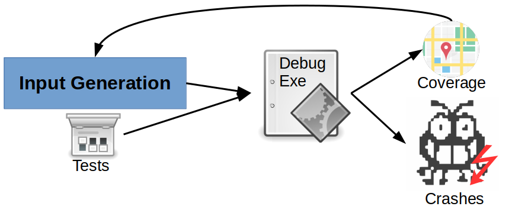

# Security

\begin{tikzpicture}
\draw [orange, ultra thick] (0,0) rectangle (2,4);
\node[text width=3cm, rotate=90] at (1, 2.5) {Virtualization};
\draw [blue, ultra thick] (3,0) rectangle (5,4);
\node[text width=3cm, rotate=90] at (4, 2.5) {Concurrency};
\draw [green, ultra thick] (6,0) rectangle (8,4);
\node[text width=3cm, rotate=90] at (7, 2.5) {Persistence};

\filldraw[draw=red, fill=red] (0,4.5) -- (8,4.5) -- (4,6) -- (0,4.5) -- cycle;
\node[text width=3cm] at (5, 5) {Security};

\end{tikzpicture}

---

# Topics covered in this lecture

* Software testing
* Fuzzing
* Sanitization

This slide deck covers [chapter 5.3 in SS3P](https://nebelwelt.net/SS3P/softsec.pdf).

---

# Why testing?

> Testing is the process of *executing code* to *find errors*.

An error is a deviation between observed behavior and specified behavior, i.e.,
a violation of the underlying specification:

* Functional requirements (features a, b, c)
* Operational requirements (performance, usability)
* Security requirements?

---

# Limitations of testing

> Testing can only show the presence of bugs, never their absence. (Edsger W. Dijkstra)

A successful test finds a deviation.  Testing is a form of dynamic analysis.
Code is executed, the testing environment observes the behavior of the code,
detecting violations.

* Key advantage: reproducible, generally testing gives you the concrete input
  for failed test cases.
* Key disadvantage: complete testing of all control-flow/data-flow paths reduces
  to the halting problem, in practice, testing is hindered due to state explosion.

---

# Forms of testing

* Manual testing
* Fuzz testing
* Symbolic and concolic testing

. . .

We focus on *security* testing or testing to find *security* bugs, i.e., bugs
that are reachable through attacker-controlled inputs.

Recommended reading: [A Few Billion Lines of Code Later: Using Static Analysis to Find Bugs in the Real World](https://cacm.acm.org/magazines/2010/2/69354-a-few-billion-lines-of-code-later/fulltext)

---

# Coverage as completeness metric

> Intuition: A software flaw is only detected if the flawed statement is
> executed. Effectiveness of test suite therefore depends on how many statements
> are executed.

---

# How to measure code coverage?

Several (many) tools exist:

* gcov: <https://gcc.gnu.org/onlinedocs/gcc/Gcov.html>
* SanitizerCoverage: <https://clang.llvm.org/docs/SourceBasedCodeCoverage.html>

---

# Fuzzing

Fuzz testing (fuzzing) is an automated software testing technique. The fuzzing
engine generates inputs based on some criteria:

* Random mutation
* Leveraging input structure
* Leveraging program structure

The inputs are then run on the test program and, if it crashes, a crash report
is generated.

---

# Fuzzing effectiveness

* Fuzzing finds bugs effectively (CVEs)
* Proactive defense, part of testing
* Preparing offense, part of exploit development

---

# Fuzz input generation

Fuzzers generate new input based on generations or mutations.

* *Generation-based* input generation produces new input seeds in each round,
  independent from each other.

* *Mutation-based* input generation leverages existing inputs and modifies
  them based on feedback from previous rounds.

---

# Fuzz input structure awareness

Programs accept some form of *input/output* Generally, the input/output is
structured and follows some form of protocol.

* *Dumb fuzzing* is unaware of the underlying structure.

* *Smart fuzzing* is aware of the protocol and modifies the input accordingly.

Example: a checksum at the end of the input. A dumb fuzzer will likely fail the
checksum.

---

# Fuzz program structure awareness

The input is processed by the program, based on the *program structure* (and from
the past executions), input can be adapted to trigger new conditions.

* *White box* fuzzing leverages semantic program analysis to mutate input
* *Grey box* leverages program instrumentation based on previous inputs
* *Black box* fuzzing is unaware of the program structure

---

# Coverage-guided grey box fuzzing

{ width=400px }

---

# American Fuzzy Lop

* AFL is the most well-known fuzzer currently
* AFL uses grey-box instrumentation to track branch coverage and mutate fuzzing
  seeds based on previous branch coverage
* The branch coverage tracks the last two executed basic blocks
* New coverage is detected on the history of the last two branches: `cur XOR prev>>1`
* AFL: <http://lcamtuf.coredump.cx/afl/>

<!-- TODO: discuss AFL-like path coverage and approximation (e.g., advantage of
keeping track of paths without having to store paths -->

---

# Fuzzer challenges: coverage wall

* After certain iterations the fuzzer no longer makes progress
* Hard to satisfy checks
* Chains of checks
* Leaps in input changes

---

# Fuzzer challenges: coverage wall

{ width=300px }

---

# Fault detection

* How do we detect program faults?

. . .

* Test cases detect bugs through
    * Assertions (`assert(var != 0x23 && "var has illegal value");`) detect violations
    * Segmentation faults
    * Division by zero traps
    * Uncaught exceptions
    * Mitigations triggering termination
* How can you increase the chances of detecting a bug?

---

# Sanitization

Sanitizers enforce a given policy, detect bugs earlier and increase
effectiveness of testing.
Most sanitizers rely on a combination of static analysis, instrumentation, and
dynamic analysis.

* The program is analyzed during compilation (e.g., to learn properties such as
  type graphs or to enable optimizations)
* The program is instrumented, often to record metadata at certain places and to
  enforce metadata checks at other places.
* At runtime, the instrumentation constantly verified that the policy is not
  violated.

What policies are interesting? What metadata do you need? Where would you check?

---

# AddressSanitizer (1/2)

AddressSanitizer (ASan) detects memory errors. It places red zones around
objects and checks those objects on trigger events. The tool can detect the
following types of bugs:

* Out-of-bounds accesses to heap, stack and globals
* Use-after-free
* Use-after-return (configurable)
* Use-after-scope (configurable)
* Double-free, invalid free
* Memory leaks (experimental)

Typical slowdown introduced by AddressSanitizer is 2x.

---

# AddressSanitizer (2/2)

* What kind of metadata would you record? Where?

* What kind of operations would you instrument?

* What kind of optimizations could you think of?

---

# ASan Metadata

Idea: store the state of each word in shadow memory (i.e., is it accessible or
not)

* An 8-byte aligned word of memory has only 9 states
* First N-bytes are accessible, 8-N are not
    * 0: all accessible
    * 7: first 7 accessible
    * 6: first 6 accessible
    * ... 
    * 1: first byte accessible
    * -1: no byte accessible
* Trade-off between alignment and encoding (extreme: 128 byte alignment, per
  byte)

<!-- TODO figure with accessible blocks and non-accessible blocks -->

---

# ASan instrumentation: memory access

```C
long *addr = getAddr();
long val;
char *shadow = (addr>>3) + shadowbse;

// 8-byte access (read/write)
if (*shadow)
  ReportError(a);
val = *addr;

// N-byte access instead:
if (*shadow && *shadow <= ((addr&7)+N-1))
```

---

# ASan instrumentation: asm

```ASM
shr $0x3,%rax       # shift by 3
mov $0x100000000000,%rcx
or %rax,%rcx        # add offset
cmpb $0x0,(%rcx)    # load shadow
je .out
ud2                 # generate SIGILL
.out:
movq $0x1234,(%rdi) # original store
```

---

# ASan instrumentation: stack

Insert red zones around objects on stack, poison them when entering stack
frames.

```C
void foo() {
  char rz1[32]; // 32-byte aligned
  char a[8];
  char rz2[24];
  char rz3[32];
  int *shadow = (&rz1 >> 3) + kOffset;
  shadow[0] = 0xffffffff; // poison rz1
  shadow[1] = 0xffffff00; // poison rz2
  shadow[2] = 0xffffffff; // poison rz3
  <------------- CODE ------------->
  shadow[0] = shadow[1] = shadow[2] = 0;
}
```

---

# ASan instrumentation: globals

Insert red zone after global object, poison in init.

```C
int a;
// translates to
struct {
  int original; 
  char redzone[60];
} a; // again, 32-byte aligned
```

---

# ASan runtime library

* Initializes shadow map at startup
* Replaces malloc/free to update metadata (and pad allocations with redzones)
* Intercepts special functions such as `memset`

---

# ASan report (1/2)

```C++
int main(int argc, char **argv) {
  int *array = new int[100];
  delete [] array;
  return array[argc];  // BOOM
}
```

---

# ASan report (2/2)

{width=450px}

---

# ASan policy

* Instrument every single access, check for poison value in shadow table
* Advantage: fast checks
* Disadvantage: large memory overhead (especially on 64 bit), still slow (2x)

---

# LeakSanitizer

LeakSanitizer detects run-time memory leaks. It can be combined with
AddressSanitizer to get both memory error and leak detection, or used in a
stand-alone mode. 

LSan adds almost no performance overhead until process termination, when the
extra leak detection phase runs.

---

# MemorySanitizer

MemorySanitizer detects uninitialized reads. Memory allocations are tagged and
uninitialized reads are flagged.

Typical slowdown of MemorySanitizer is 3x.

Note: do not confuse MemorySanitizer and AddressSanitizer.

---

# UndefinedBehaviorSanitizer

UndefinedBehaviorSanitizer (UBSan) detects undefined behavior. It instruments
code to trap on typical undefined behavior in C/C++ programs. Detectable errors
are:

* Unsigned/misaligned pointers
* Signed integer overflow
* Conversion between floating point types leading to overflow
* Illegal use of NULL pointers
* Illegal pointer arithmetic
* ...

Slowdown depends on the amount and frequency of checks. This is the only
sanitizer that can be used in production. For production use, a special minimal
runtime library is used with minimal attack surface.

---

# ThreadSanitizer

ThreadSanitizer detects data races between threads. It instruments writes to
global and heap variables and records which thread wrote the value last,
allowing detecting of WAW, RAW, WAR data races.

Typical slowdown is 5-15x with 5-15x memory overhead.

---

# HexType

HexType detects type safety violations. It records the true type of allocated
objects and makes all type casts explicit.

Typical slowdown is 0.5x.

---

# Sanitizers

* AddressSanitizer: <https://clang.llvm.org/docs/AddressSanitizer.html>
* LeakSanitizer: <https://clang.llvm.org/docs/LeakSanitizer.html>
* MemorySanitizer: <https://clang.llvm.org/docs/MemorySanitizer.html>
* UndefinedBehaviorSanitizer: <https://clang.llvm.org/docs/UndefinedBehaviorSanitizer.html>
* ThreadSanitizer: <https://clang.llvm.org/docs/ThreadSanitizer.html>
* HexType: <https://github.com/HexHive/HexType>

Use sanitizers to test your code. More sanitizers are in development.

---


# Summary and conclusion

* Software testing finds bugs before an attacker can exploit them
* Manual testing: write test cases to trigger exceptions
* Fuzz testing automates and randomizes testing
* Sanitizers allow early bug detection, not just on exceptions
* AddressSanitizer is the most commonly used sanitizer and enforces
  probabilistic memory safety by recording metadata for every allocated object
  and checking every memory read/write.

Don't forget to get your learning feedback through the Moodle quiz!