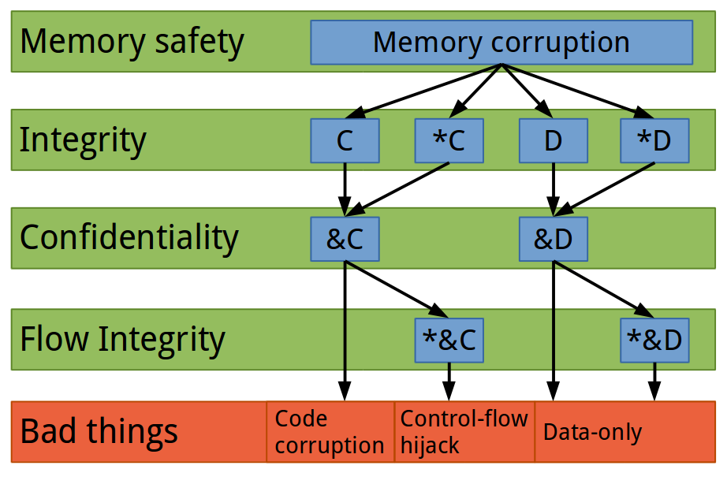
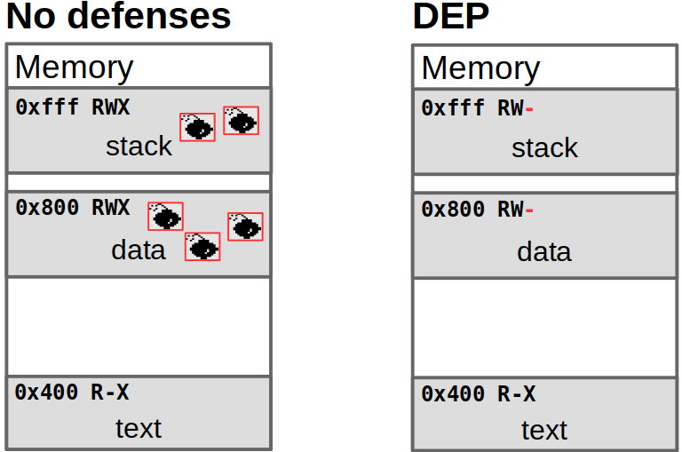
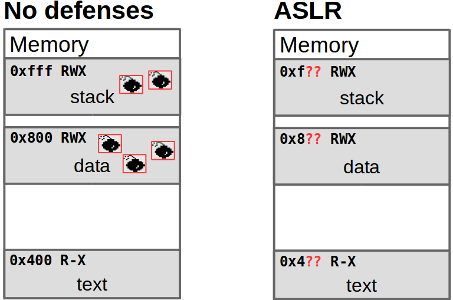
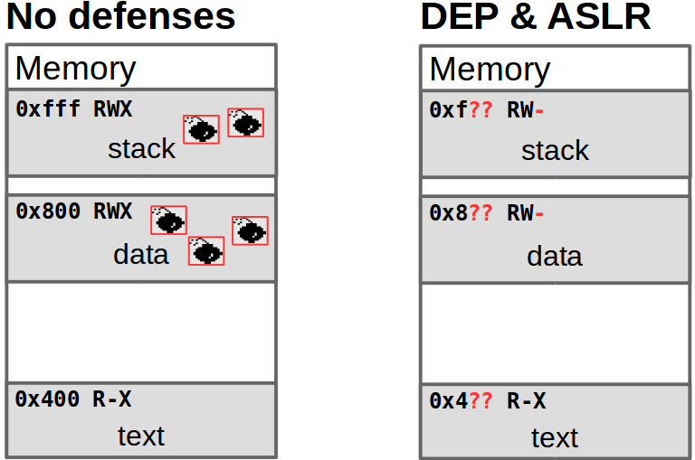

# Topics covered in this lecture

* Data Execution Prevention
* Address Space Layout Randomization
* Stack canaries
* Control-Flow Integrity (CFI)

This slide deck covers [chapter 5.4 in SS3P](https://nebelwelt.net/SS3P/softsec.pdf).

---

# Model for Control-Flow Hijack Attacks



---

# Widely-adopted defense mechanisms

* Hundreds of defense mechanisms were proposed
* Only few mitigations were adopted
* Factors that increase chances of adoption:
    * Mitigation of the most imminent problem
    * (Very) low performance overhead
    * Fits into the development cycle

---

# Attack vector: code injection

* Simplest form of code execution
* Generally consists of two steps:
    * Inject `code` somewhere into the process
    * Redirect control-flow to injected code 

---

# Data Execution Prevention (DEP)

* No distinction between code and data (e.g., x86, ARM)
* Any data in the process could be interpreted as code (code injection: an
  attacker redirects control-flow to a buffer that contains attacker-controlled
  data as shellcode)
* ***Defense assumption:*** if an attacker cannot inject code (as data), then a
  code execution attack is not possible.

---

# DEP: process layout



---

# DEP implementation

* HW extension, add NX-bit (No eXecute) to page table entry
    * Intel calls this per-page bit XD (eXecute Disable)
    * AMD calls it Enhanced Virus Protection
    * ARM calls it XN (eXecute Never)
* This is an additional bit for every mapped virtual page. If the bit is
  set, then data on that page cannot be interpreted as code and the processor
  will trap if control flow reaches that page.

---

# DEP summary

* DEP is now enabled widely by default (whenever a hardware support is
  available such as for x86 and ARM)
* Stops all code injection
* Check for DEP with [checksec.sh](https:////github.com/slimm609/checksec.sh)
* DEP may be disabled through gcc flags: `-z execstack`

---

# Attacks evolve: from code injection to reuse

* Did DEP solve all code execution attacks?

. . .

* Unfortunately not! But attacks got (much?) harder
* A code injection attack consists of two stages: 
    a) redirecting control flow
    b) to injected code
* DEP prohibits the code injection, not control-flow hijacking
    * Attackers can still redirect control flow to ***existing*** code

---

# Code reuse

* The attacker can overwrite a code pointer (e.g., a function pointer, or a
  return pointer on the stack)
* Prepare the right parameters on the stack, reuse a full function (or part of
  a function)

---

# From Code Reuse to full ROP

Instead of targeting a simple function, we can target a gadget

* Gadgets are a sequence of instructions ending in an indirect control-flow
  transfer (e.g., return, indirect call, indirect jump)
* Prepare data and environment so that, e.g., pop instructions load data into
  registers
* A gadget invocation frame consists of a sequence of 0 to n data values and an
  pointer to the next gadget. The gadget uses the data values and transfers
  control to the next gadget

[Link to simple ROP tutorial](https://crypto.stanford.edu/~blynn/rop/)

---

# Address Space Randomization (ASR)

> The security improvement of ASR depends on (i) the available entropy
> for randomized locations, (ii) the completeness of randomization (i.e., are 
> all objects randomized), and (iii) the absence of information leaks.

. . .

* Successful control-flow hijack attacks depend on the attacker overwriting
  a code pointer with a known alternate target
* ASR changes (randomizes) the process memory layout
* If the attacker does not know where a piece of code (or data) is, then it
  cannot be reused in an attack
* Attacker must first ***learn*** or recover the address layout

---

# Candidates for randomization

* Trade-off between overhead, complexity, and security benefit.
* Randomize start of heap
* Randomize start of stack
* Randomize start of code (PIE for executable, PIC each library)
* Randomize mmap allocated regions
* Randomize individual allocations (malloc)
* Randomize the code itself, e.g., gap between functions, order of
  functions, basic blocks, ...
* Randomize members of structs, e.g., padding, order.

Different forms of fine-grained randomization exist. Software diversity is a
related concept.

---

# Address Space *Layout* Randomization (ASLR)

> ASLR is a practical form of ASR.

* ASLR focuses on blocks of memory
* Heap, stack, code, executable, mmap regions
* ASLR is inherently page-based

---

# ASLR entropy

* Assume start addresses of all sections are randomized
* Entropy of each section is key to security
* Attacker targets section with lowest entropy
* Early ASLR implementations had low entropy on the stack and no entropy on
  x86 for the executable (non-PIE executables)
* Linux (through Exec Shield) uses 19 bits of entropy for the stack (on 16
  byte period) and 8 bits of mmap entropy (on 4096 byte period).

---

# ASLR changes to the address space



---

# ASLR and DEP changes to the address space



---

# Stack canaries

* Attacks relied on a stack-based buffer overflow to inject code
* Memory safety would mitigate this problem but adding full safety checks is
  not feasible due to high performance overhead
* Key insight: buffer overflows require pointer arithmetic
    * Instead of checking each memory dereference during function execution,
      we check the integrity of a variable once
* ***Assumption:*** we only prevent RIP control-flow hijack attacks
* We therefore only need to protect the integrity of the return instruction
  pointer


---

# Stack canaries

* Place a canary after a potentially vulnerable buffer
* Check the integrity of the canary before the function returns
* The compiler may place all buffers at the end of the stack frame and the
  canary just before the first buffer. This way, all non-buffer local variables
  are protected as well.
* Limitation: the stack canary only protects against ***continuous overwrites***
  iff the attacker does ***not know*** the canary
* An alternative is to encrypt the return instruction pointer by xoring it
  with a secret

---

# Stack protector: code

```C
char unsafe(char *vuln) {
  char foo[12];
  strcpy(foo, vuln);
  return foo[1];
}

int main(int ac,
    char* av[]) {
  unsafe(argv[0]);
  return 0;
}
```

---

# Stack protector: assembly

```ASM
push   %rbp
mov %rsp,%rbp
sub    $0x30,%rsp
mov    %rdi,-0x28(%rbp)
mov    %fs:0x28,%rax         ; load secret canary
mov    %rax,-0x8(%rbp)       ; store canary on stack
xor    %eax,%eax             ; clear register
mov    -0x28(%rbp),%rsi
lea    -0x20(%rbp),%rdi
callq  <strcpy@plt>
movzbl -0x1f(%rbp),%eax
mov    -0x8(%rbp),%rcx       ; load canary from stack
xor    %fs:0x28,%rcx         ; check canary
je     <out>
callq <__stack_chk_fail@plt> ; terminate if check failed
out: leaveq, retq  
```

---

# Other mitigations

* Fortify source: protect against format string attacks
* Safe exception handling: protect against popping exception frames


---

# Control-Flow Integrity

> CFI is a defense mechanism that protects applications against control-flow
> hijack attacks. A successful CFI mechanism ensures that the control-flow of
> the application never leaves the predetermined, valid control-flow that is
> defined at the source code/application level. This means that an attacker
> cannot redirect control-flow to alternate or new locations.

{width=8cm}

---

# Basics of a CFI mechanism

Core idea: restrict the dynamic control flow of the application to the
control-flow graph of the application.

* Target set construction
* Dynamic enforcement mechanism to execute runtime checks

---

# CFI: target set construction

How do we infer the control-flow graph (for C/C++ programs)?
A static analysis (on source code or binary) can recover an approximation of the
control-flow graph. Precision of the analysis is crucial!

* Valid functions
* Arity
* Function prototypes
* Class hierarchy analysis

---

# CFI: target set construction

* Trade-off between precision and compatibility.

* A single set of ***valid functions*** is highly compatible with other software
  but results in imprecision due to the large set size

* ***Class hierarchy analysis*** results in small sets but may be incompatible with
  other source code and some programmer patterns (e.g., casting to void or not
  passing all parameters)

---

# CFI: limitations

* CFI allows the underlying bug to fire and the memory corruption can be
  controlled by the attacker. The defense only detects the deviation after the
  fact, i.e., when a corrupted pointer is used in the program
* Over-approximation in the static analysis reduces security guarantees
* Some attacks remain possible
    * An attacker is free to modify the outcome of any conditional jump (e.g.,
      `if` clauses depend on unprotected data values)
    * An attacker can choose any allowed target at each indirect control-flow
      transfer location
    * For return instructions: one set of return targets is too broad and even
      localized return sets are too broad for most cases
    * For indirect calls and jumps, attacks like COOP (Counterfeit Object
      Oriented Programming) have shown that full functions serve as gadgets

---

# Summary and conclusion

* Deployed mitigations do not stop all attacks
* ***Data Execution Prevention*** stops code injection attacks, but does not
  stop code reuse attacks
* ***Address Space Layout Randomization*** is probabilistic, shuffles memory
  space, prone to information leaks
* ***Stack Canaries*** are probabilistic, do not protect against direct
  overwrites, prone to information leaks
* ***CFI*** restricts control-flow hijack attacks, does not protect against
  data-only attacks

Don't forget to get your learning feedback through the Moodle quiz!
