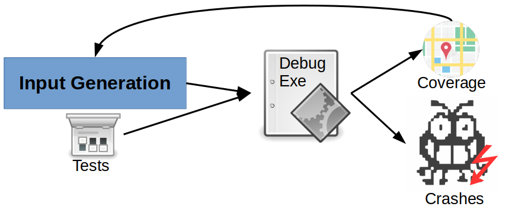
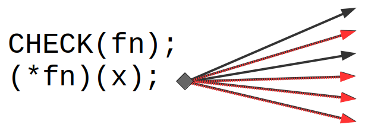

# Security

\begin{tikzpicture}
\draw [orange, ultra thick] (0,0) rectangle (2,4);
\node[text width=3cm, rotate=90] at (1, 2.5) {Virtualization};
\draw [blue, ultra thick] (3,0) rectangle (5,4);
\node[text width=3cm, rotate=90] at (4, 2.5) {Concurrency};
\draw [green, ultra thick] (6,0) rectangle (8,4);
\node[text width=3cm, rotate=90] at (7, 2.5) {Persistence};

\filldraw[draw=red, fill=red] (0,4.5) -- (8,4.5) -- (4,6) -- (0,4.5) -- cycle;
\node[text width=3cm] at (5, 5) {Security};

\end{tikzpicture}

---

# Two topics: testing and mitigations

* Developers find as many bugs as possible by testing software
    * Fuzzing generates test cases
    * Sanitization detects policy violations
* Mitigations detect policy violations at runtime, stop exploits
* OS support both testing and mitigations, making them efficient

---

# Fuzzing

Fuzz testing (fuzzing) is an automated software testing technique. The fuzzing
engine generates inputs based on some criteria:

* Random mutation
* Leveraging input structure
* Leveraging program structure

The inputs are then run on the test program and, if it crashes, a crash report
is generated.

---

# Fuzzing dimensions

Fuzzers can be classified along three dimensions:

* How are new inputs created?
    * Generational fuzzers create input based on a description
    * Mutational fuzzers modify an existing input
* Aware of input structure (e.g., the PNG format)?
    * Smart fuzzers mutate according to valid format
    * Dumb fuzzers mutate randomly
* Aware of program structure (e.g., execution path)?
    * White-box fuzzers are aware of full path constraints
    * Grey-box fuzzers are aware of coverage
    * Black-box fuzzers have no clue

A mutational dumb grey-box fuzzer uses coverage feedback from program execution
to randomly modify seeds that have resulted in new coverage.

---

# Coverage-guided grey box fuzzing

{ width=400px }

---

# Sanitization

Sanitizers enforce a given policy, detect bugs earlier and increase
effectiveness of testing.

Most sanitizers rely on a combination of static analysis, instrumentation, and
dynamic analysis.

* The program is analyzed during compilation (e.g., to learn properties such as
  type graphs or to enable optimizations)
* The program is instrumented, often to record metadata at certain places and to
  enforce metadata checks at other places.
* At runtime, the instrumentation constantly verified that the policy is not
  violated.

What policies are interesting? What metadata do you need? Where would you check?

---

# AddressSanitizer

AddressSanitizer (ASan) detects memory errors. It places red zones (padding 
areas) around objects and, for checks that no memory operation accesses these
padding areas. The tool can detect the following types of bugs:

* Out-of-bounds accesses to heap, stack and globals
* Use-after-free
* Use-after-return (configurable)
* Use-after-scope (configurable)
* Double-free, invalid free
* Memory leaks (experimental)

Typical slowdown introduced by AddressSanitizer is 2x.

---

# Sanitizers

* AddressSanitizer: finds memory errors
* LeakSanitizer: finds memory leaks (extends ASan)
* MemorySanitizer: finds uninitialized reads
* UndefinedBehaviorSanitizer: finds integer overflows
* ThreadSanitizer: finds thread race conditions
* HexType: finds type violations

---

# Testing summary

* Software testing finds bugs before an attacker can exploit them
* Manual testing: write test cases to trigger exceptions
* Fuzz testing automates and randomizes testing
* Sanitizers allow early bug detection, not just on exceptions
* AddressSanitizer is the most commonly used sanitizer and enforces
  probabilistic memory safety by recording metadata for every allocated object
  and checking every memory read/write.

---

# Data Execution Prevention (DEP)

* No distinction between code and data (e.g., x86, ARM)
* Any data in the process could be interpreted as code (code injection: an
  attacker redirects control-flow to a buffer that contains attacker-controlled
  data as shellcode)
* ***Defense assumption:*** if an attacker cannot inject code (as data), then a
  code execution attack is not possible.

---

# Address Space ***Layout*** Randomization (ASLR)

* Successful control-flow hijack attacks depend on the attacker overwriting
  a code pointer with a known alternate target
* ASR changes (randomizes) the process memory layout
* If the attacker does not know where a piece of code (or data) is, then it
  cannot be reused in an attack
* Attacker must first *learn* or recover the address layout
* ASLR focuses on blocks of memory
* Heap, stack, code, executable, mmap regions
* ASLR is inherently page-based

---

# Stack canaries

* Place a canary after a potentially vulnerable buffer
* Check the integrity of the canary before the function returns
* The compiler may place all buffers at the end of the stack frame and the
  canary just before the first buffer. This way, all non-buffer local variables
  are protected as well.
* Limitation: the stack canary only protects against ***continuous overwrites***
  iff the attacker does ***not know*** the canary
* An alternative is to encrypt the return instruction pointer by xoring it
  with a secret

---

# Control-Flow Integrity

> CFI is a defense mechanism that protects applications against control-flow
> hijack attacks. A successful CFI mechanism ensures that the control-flow of
> the application never leaves the predetermined, valid control-flow that is
> defined at the source code/application level. This means that an attacker
> cannot redirect control-flow to alternate or new locations.

{width=8cm}

---

# Mitigations Summary

* Deployed mitigations do not stop all attacks
* Data Execution Prevention stops code injection attacks, but does not
  stop code reuse attacks
* Address Space Layout Randomization is probabilistic, shuffles memory space,
  prone to information leaks
* Stack Canaries are probabilistic, do not protect against direct
  overwrites, prone to information leaks
* CFI restricts control-flow hijack attacks, does not protect against
  data-only attacks
