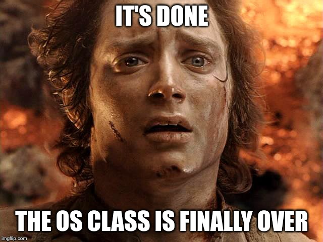
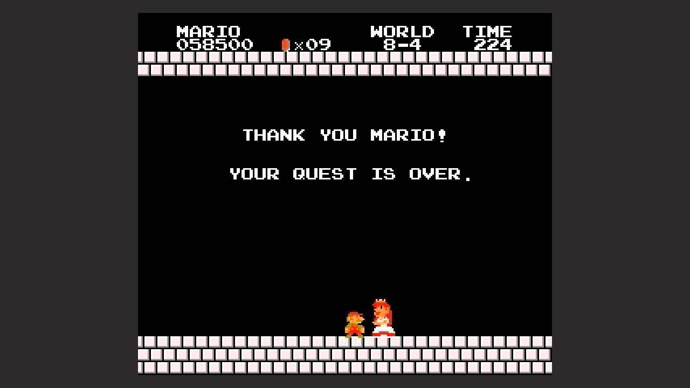

# Virtualization

\begin{tikzpicture}
\draw [fill, orange, ultra thick] (0,0) rectangle (2,4);
\node[text width=3cm, rotate=90] at (1, 2.5) {Virtualization};
\draw [blue, ultra thick] (3,0) rectangle (5,4);
\node[text width=3cm, rotate=90] at (4, 2.5) {Concurrency};
\draw [green, ultra thick] (6,0) rectangle (8,4);
\node[text width=3cm, rotate=90] at (7, 2.5) {Persistence};

\draw [red, ultra thick] (0,4.5) -- (8,4.5);
\draw [red, ultra thick] (0,4.5) -- (4,6);
\draw [red, ultra thick] (4,6) -- (8,4.5);
\node[text width=3cm] at (5, 5) {Security};

\end{tikzpicture}

---

# Virtualization: Summary

\begin{tikzpicture}[level distance=1.5cm,
  level 1/.style={sibling distance=6cm},
  level 2/.style={sibling distance=2.5cm}]
  \node {Virtualization}
    child {node {CPU}
      child {node {Processes}}
      child {node {Scheduling}}
    }
    child {node {Memory}
      child {node {Allocation}}
      child {node {Segmentation}}
      child {node {Paging}}
    };
\end{tikzpicture}

---

# CPU Virtualization: Processes and Scheduling

* Processes are a purely virtual concept
* Separating policies and mechanisms enables modularity
* Schedulers need to optimize for different metrics: utilization, turnaround,
  response time, fairness and forward progress
    * FIFO: simple, non-preemptive scheduler
    * SJF: non-preemptive, prevents process jams
    * STFC: preemptive, prevents jams of late processes
    * RR: preemptive, great response time, bad turnaround
    * MLFQ: preemptive, most realistic
    * CFS: fair scheduler by virtualizing time
* Past behavior is good predictor for future behavior

---

# Memory Virtualization: Segmentation and Paging

* OS manages access to constrained resources
    * Principle: limited direct execution (bare metal when possible, intercept
      when needed)
    * CPU: time sharing between processes (low switching cost)
    * Memory: space sharing (disk I/O is slow, so time sharing is expensive)
* Fragmentation: space lost due to internal or external padding
* Paging: MMU fully translates between virtual and physical addresses
    * One flat page table (array)
    * Multi-level page table
    * Pros? Cons? What are size requirements?
* Paging and swapping allows process to execute with only the working set
  resident in memory, remaining pages can be stored on disk

---

# Concurrency

\begin{tikzpicture}
\draw [orange, ultra thick] (0,0) rectangle (2,4);
\node[text width=3cm, rotate=90] at (1, 2.5) {Virtualization};
\draw [fill, blue, ultra thick] (3,0) rectangle (5,4);
\node[text width=3cm, rotate=90] at (4, 2.5) {Concurrency};
\draw [green, ultra thick] (6,0) rectangle (8,4);
\node[text width=3cm, rotate=90] at (7, 2.5) {Persistence};

\draw [red, ultra thick] (0,4.5) -- (8,4.5);
\draw [red, ultra thick] (0,4.5) -- (4,6);
\draw [red, ultra thick] (4,6) -- (8,4.5);
\node[text width=3cm] at (5, 5) {Security};

\end{tikzpicture}

---

# Concurrency topics

* Abstraction: locks to protect shared data structures
* Mechanism: interrupt-based locks
* Mechanism: atomic hardware locks
* Busy waiting (spin locks) versus wait queues
* Condition variables
* Semaphores
* Signaling through condition variables and semaphores

---

# Difference parallelism and concurrency

* Parallelism: multiple threads (or processes) working on a single task using
  multiple CPU cores (i.e., stuff happens at the same physical time)
* Concurrency: tasks can start, run, and complete in overlapping time periods
  (i.e., tasks run at the same virtual time)

---

# Concurrency summary

* Spin lock, CV, and semaphore synchronize multiple threads/processes
    * Spin lock: atomic access, no ordering, spinning
    * Condition variable: atomic access, queue, OS primitive
    * Semaphore: shared access to critical section with (int) state
* All three primitives are equally powerful
    * Each primitive can be used to implement both other primitives
    * Performance may differ!
* Synchronization is challenging and may introduce different types of
  bugs such as atomicity violation, order violation, or deadlocks.

---

# Persistence

\begin{tikzpicture}
\draw [orange, ultra thick] (0,0) rectangle (2,4);
\node[text width=3cm, rotate=90] at (1, 2.5) {Virtualization};
\draw [blue, ultra thick] (3,0) rectangle (5,4);
\node[text width=3cm, rotate=90] at (4, 2.5) {Concurrency};
\draw [fill, green, ultra thick] (6,0) rectangle (8,4);
\node[text width=3cm, rotate=90] at (7, 2.5) {Persistence};

\draw [red, ultra thick] (0,4.5) -- (8,4.5);
\draw [red, ultra thick] (0,4.5) -- (4,6);
\draw [red, ultra thick] (4,6) -- (8,4.5);
\node[text width=3cm] at (5, 5) {Security};

\end{tikzpicture}

---

# Persistence Topics

* Device interaction and device drivers
* IO Scheduling and harddrive throughput
* Filesystem API
* Filesystem implementation
    * Inodes and devices
    * File descriptors
    * File names
* Crash resistance
* Journaling

---

# IO/Driver Summary

* Overlap IO and computation as much as possible!
    * Use interrupts
    * Use DMA
* Driver classes provide common interface
* Storage: read/write/seek of blocks
* Minimize random IO (i.e., quick sort is really bad on HDDs)
* Carefully schedule IO on slow devices
* RAID virtualizes disks

Don't forget to get your learning feedback through the Moodle quiz!

---

# Filesystem summary

* Filesystem API: handle interaction with the file system
* Three ways to identify a file
    * File names (for humans)
    * Inodes and devices (on the disk)
    * File descriptors (for a process)
* Filesystem implementation
    * Inodes for metadata
    * Bitmaps for inodes/data blocks
    * Superblock for global metadata
* Crash resistance: filesystem check (FSCK)
* Journaling: keep track of metadata, enforce atomicity
    * All modern filesystems use journaling
    * FSCK still useful due to bitflips/bugs

---

# Security

\begin{tikzpicture}
\draw [orange, ultra thick] (0,0) rectangle (2,4);
\node[text width=3cm, rotate=90] at (1, 2.5) {Virtualization};
\draw [blue, ultra thick] (3,0) rectangle (5,4);
\node[text width=3cm, rotate=90] at (4, 2.5) {Concurrency};
\draw [green, ultra thick] (6,0) rectangle (8,4);
\node[text width=3cm, rotate=90] at (7, 2.5) {Persistence};

\filldraw[draw=red, fill=red] (0,4.5) -- (8,4.5) -- (4,6) -- (0,4.5) -- cycle;
\node[text width=3cm] at (5, 5) {Security};

\end{tikzpicture}

---

# Two topics: testing and mitigations

* Testing helps developers to find as many bugs as possible
    * Fuzzing generates test cases
    * Sanitization detects policy violations
* Mitigations detect policy violations at runtime, stop exploits

---

# Testing summary

* Software testing finds bugs before an attacker can exploit them
* Manual testing: write test cases to trigger exceptions
* Fuzz testing automates and randomizes testing
* Sanitizers allow early bug detection, not just on exceptions
* AddressSanitizer is the most commonly used sanitizer and enforces
  probabilistic memory safety by recording metadata for every allocated object
  and checking every memory read/write.

---

# Mitigations Summary

* Deployed mitigations do not stop all attacks
* Data Execution Prevention stops code injection attacks, but does not
  stop code reuse attacks
* Address Space Layout Randomization is probabilistic, shuffles memory space,
  prone to information leaks
* Stack Canaries are probabilistic, do not protect against direct
  overwrites, prone to information leaks
* CFI restricts control-flow hijack attacks, does not protect against
  data-only attacks

---

# Learning goals: class

* Learn core concepts
* Become aware of design decisions and policies
    * Virtualization: CPU and Memory
    * Concurrency: performance trade-offs
    * Persistence: correctness and recovery
    * Security: software testing versus mitigations

---

# Learning goals: labs

* Lab 0: practice C programming and debugging
* Lab 1: thread scheduling and memory allocation
* Lab 2: concurrency and message passing
* Lab 3: simple file system
* Lab 4: software security testing

But the main goal was to become better programmers, i.e., using a specification
to implement and test a prototype, then integrate it into the overall system.

---

# Final Exam

* Closed book, 90 minutes, Dec16 16:15 in CM2
* Similar style of questions as midterm
* 2/3 of the questions from after the midterm, 1/3 from before
    * Go through the slides
    * Read the covered book chapters (in OS: 3EP and SS3P)
    * Be aware of the project challenges
    * Use the large Moodle quiz to go check if you understood the material
    * Use the mock exam to prepare for the type of questions
* Office hour: Dec13 14:00-16:00 in BC160

---

# All done?

{width=400px}

---

# Feedback

* Feedback is appreciated
* Planned changes for next year
    * Projects in groups of 2-3 students
    * Mock exams for both midterm and final
    * Extra points for quizzes throughout the semester
* Let me know what else you were missing!

---

# All done?

{width=400px}
